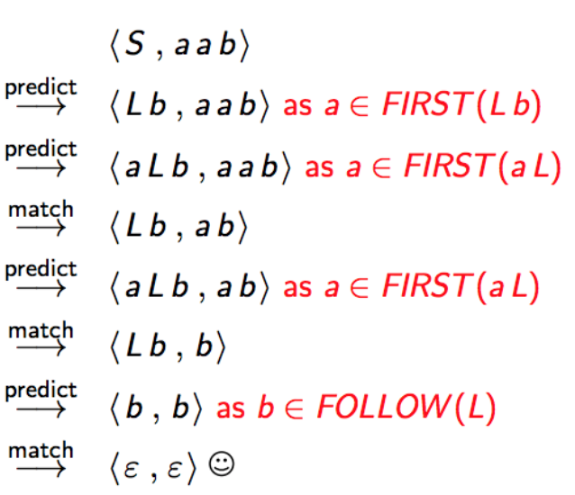

# LL Parsing  stack machine
Assuming a context-free grammar. The top of the stack is on the left.

```
<A pi, w> predict -> <\a pi, w>     If there is a rule A -> \a
<a pi, a w> match -> <pi, w>
```

If there is a non-terminal `A` on the top of the stack and there is a rule `A -> \a`, then pop `A` off and push `\a` on. If there is a terminal `a` on the stack and at the start of the input, then pop `a` off and advance the input.

```
<S, w>      Is the initial state for input w, where S is the start symbol
<\e, \e>    Is the accepting state
```

## Accepting a given input in an LL machine
**Definition:** An input string `w` is accepted iff there is a sequence of steps leading from the initial state to the accepting state.

**Theorem:** An input string is accepted iff it can be derived by the grammar

## LL machine example
```
S -> L b
L -> a L
L -> \e
```

Initial state is `<S, a a b>`.

1. Predict `L b`: `<L b, a a b>`
2. Predict (using lookahead) `a L`: `<a L b, a a b>`
3. Match: `<L b, a b>`
4. Predict (using lookahead) `a L`: `<a L b, a b>`
5. Match: `<L b, b>`
6. Predict (using lookahead) `\e`: `<b, b>`
7. Match: `<b, b>`
8. Match: `<, >`

In accepting state so parsing succeeds

Initial state is `<S, b a>`

1. Predict `L b`: `<L b, b a>`
2. Predict (using lookahead) `\e`: `<b, b a>`
3. Match: `<\e, a>`

Not in accepting state so parsing fails

## Making an LL machine deterministic
One symbol of lookahead (first symbol in remaining input) is used to guide move prediction and to avoid predicting moves that cause the machine to get stuck.

```
A -> \a1
A -> \a2
```

Input: `b w`

Choice is made by checking if either `\a1` or `\a2` can derive `b \c`, where `\c` is some string and  `b` is the top of the remaining input.

Formally: `\ai *=> b \c`

```
E -> A B
E -> f
A -> c
A -> \e
B -> d
```
Machine state: `<E pi, d w>`

We need two new machine steps for this grammar:
* **FIRST**: A terminal `b` is in `FIRST(\a)` if there exists a `\b` such that
  `\a *=> b \b`
  that is, `b` is the first symbol in something derivable from `\a`
* **FOLLOW**: A terminal `b` is in `FOLLOW(X)` if there exists `\a` and `\b` such that
  `S *=> \a X b \b`
  that is, `b` follows `X` in some derivation
* **nullable**: `\a` is nullable if
  `a *=> \e`
  that is, we can derive the empty string from it

### First and Follow example
```
S -> L b
L -> a L
L -> \e
```

```
a € FIRST(L) as it is the first symbol of an L rule
b € FOLLOW(L) as it follows an L symbol in some rule
L is nullable as it can derive \e
```

## LL(1) machine with FIRST and FOLLOW
We update the LL machine's prediction step to make it LL(1)
```
<A pi, w> predict -> <\a pi, w>
  if there is a rule A -> \a
  and `b € FIRST(\a)`
<A pi, w> predict -> <\b pi, w>
  if there is a rule A -> \b
  and \b is nullable
  and `b € FOLLOW(\A)`
<A pi, w> predict -> <pi, w>
  if there is a rule A -> \e
  and b € FOLLOW(A)
```

Example

```
S -> L b
L -> a L
L -> \e
```

Initial state: `<S, a a b>`

1. Predict `<L b, a a b>` as `a € FIRST(L b)`
2. Predict `<a L b, a a b>` as `a € FIRST(a L)`
3. Match `<L b, a b>`

Full example:


For some grammars there may be:
* **FIRST/FIRST conflicts**
* **FIRST/FOLLOW conflicts**
