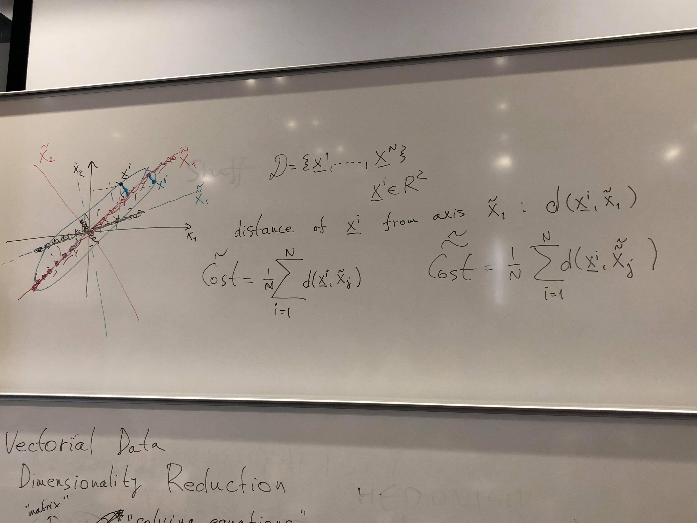

# Dimensionality Reduction
The act of reducing the dimensions in a set of data to those relevant. E.g in data with height and weight as axes and each point being a person, the most relevant dimension is actually age, rather than height and weight. Dimensionality reduction is just the way you find new axes that are more relevant to the dat in question.

In this image of of 3D data set, you can see that the most relevant axis is `\b`, rather than `x3` or `x2`

Distance from data point `_x^i` (vector notation) and the axis `x2` is `d(_x^i, x^2)`. When projecting the data points along the new axis, the axis that gives the greatest distance between each projected point is the preferred one.

## Covariance

The variance of the projections of graph 1 and graph 2 is indistinguishable, so the variance of two axes must be used. This is the covariance. The link between axes `X1 and X2` of graph 2 is that when `X1` grows ...

Non-zero covariance means that there is redundancy in the dimensions used. Rotating the axes will produce two axes that have little covariance, but this produces the more relevant dimensions to view the data by.

->

From this rotation, we see that the new `x1` is the relevant axis to view the data by.

## Covariance matrices
A matrix of the covariance between each axis.

the covariance between the same axes is `Var[Xj]`, i.e `Cov[Xj, Xj] = Var[Xj]`

`Cj,k = Cov[Xj, Xk]`, `^Cj,k = ^Cov[Xj, Xk]`

To avoid subtracting the expected value each time you calculate the covariance of two random variables, shift the data points to be around the origin by subtracting the mean from each point. The you can calculate the covariance with `Cov[X, Y] = (1/N) * Sum[1, N](x^i * y^i)` without subtracting the expected value.

The estimated covariance matrix can be calculated with `^C = (1/N) * $*$^T` where `$` is the matrix of all data points, `$^T` is the transposed `$` matrix. `$` should really be a fancy `X` but I can't write that here.

So the estimated covariance of certain random variables is `^C2,3 = (1/2) * [X2^1 * X3^1 + X2^2 + X3^2] = (1/N) * Sum[1, 2](X2^i * X3^i)` for a data set with vectors of 2 dimensions.

## Rotating axes
We want to transform the original data set `D = {X^1, X^2, ..., X^N}, x e R^d` to `~D = {~X^1, ~X^2, ..., ~X^N}, ~x e R^d`

For a data point `X^i`, multiply it with the transposed matrix of normalised axis vectors `V^T` to get `~X^i`. `V^T * X^i = ~X^i`. Finding the old points from the transformed data set `X = (V^T)-1 * ~X = V * ~X`

The covariance matrix of the new points is `~C = V^T * C * V` (from `~C = (1/N) * ~$ * ~$^T`). The old covariance matrix can be found with `C = (V^T)^-1 * ~C * V^-1` (see below for a simplification).

### Finding (V^T)^-1
`a^T * a = ||a||^2`

`V^T * (V^T)^-1 = Ø` where `(V^T)^-1` is the inverse of `V^T`.

All of the axes in the vector are orthogonal, their dot products are 0 so `(V^T)^-1` is just `V^T^T = V`. This is because the product of an orthogonal matrix and its transposition is the identity matrix.

Therefore `C = (V^T)^-1 * ~C * V^-1` can be simplified to `C = V * ~C * V^T`

## Finding the new axes
For any square and symmetric matrix `A` of `d` dimensions, there is a vector (eigen vector) `v` such that `A * d = \l * d` where `\l e R` (eigen value). The direction of `v` hasn't changed, only the magnitude has. There are `d` such eigen vectors for `A` and each has a different eigen value.

...

## Choosing what axes are relevant
Given some `k <= d` where `d` is the number of axes, and a matrix of axes `X`. Divide the sum of the first `k` variances of `X` by the sum of all variances of `X`.

`(Var[X1] + Var[X2] + ... + Var[Xk])/(Var[X1] + Var[X2] + ... + Var[Xd]) = \Pk`

These variance values are the eigen values from above. Find the `k` such that `\Pk` is > 0.5 (the axes that cover the majority of the variance in the data points), 0.8 is a good suggestion.
