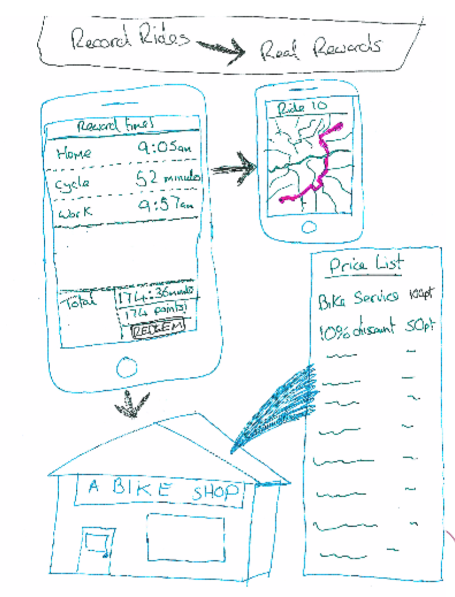
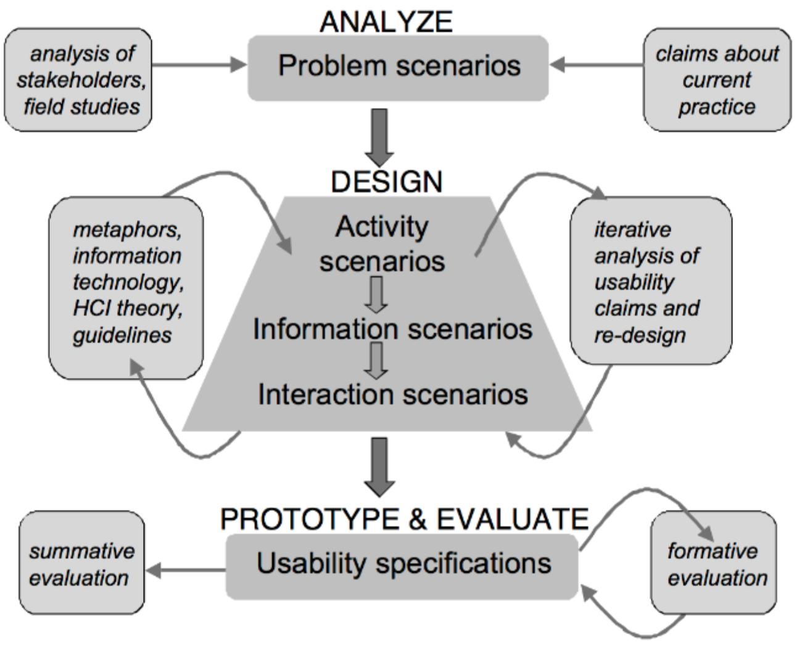
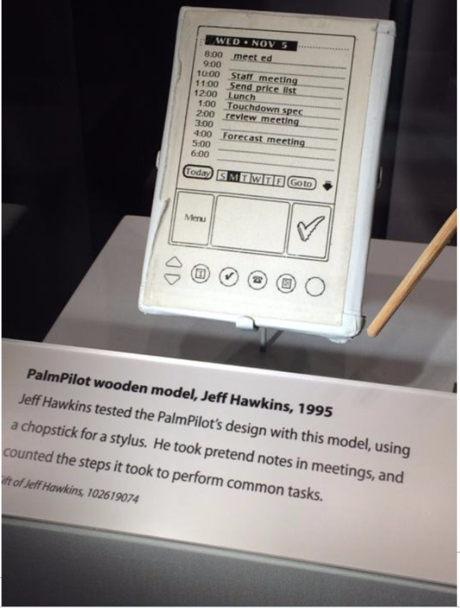
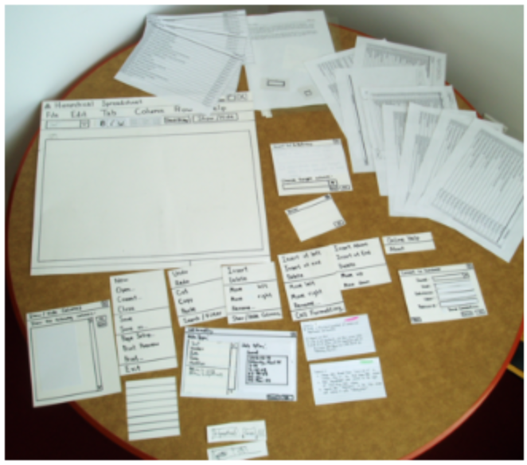
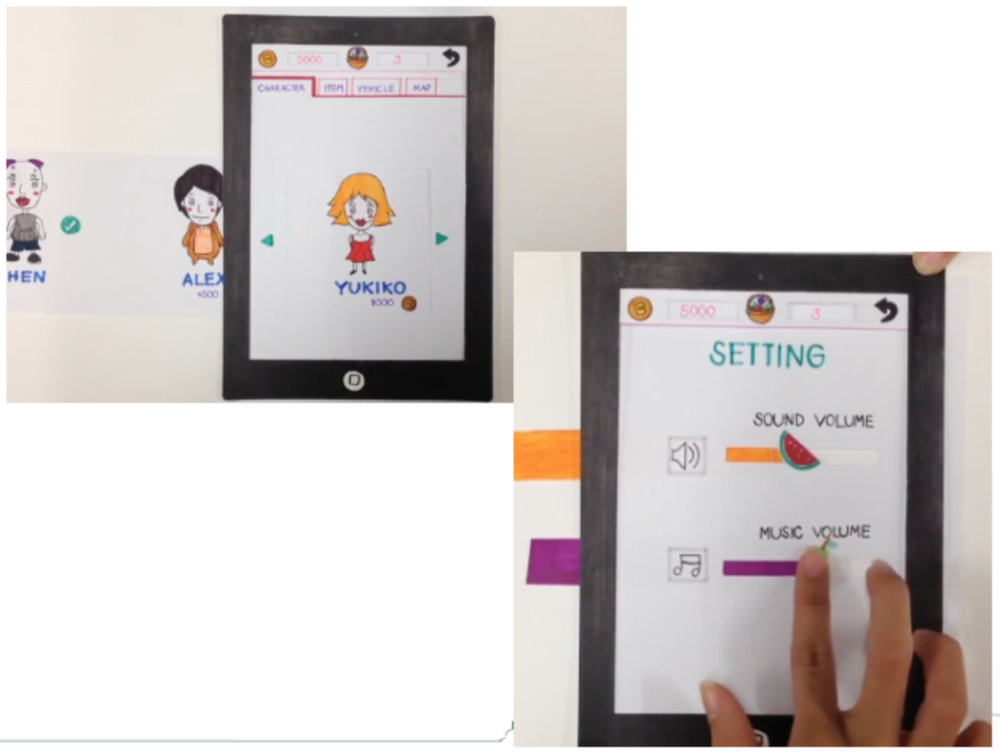
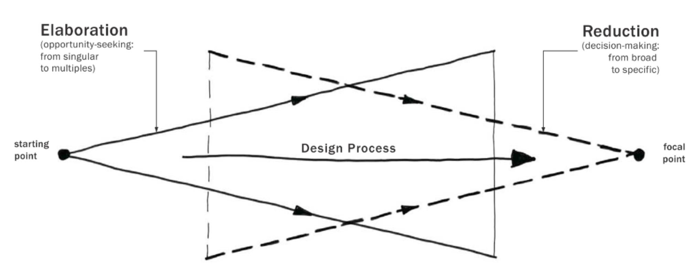

# Design
How do you get a design right?

1. Start at the 'bottom of the hill' with an idea
2. 'Climb the hill' by evaluating the design
3. Keep going until the design can't get better

However another idea could have had more potential than the current idea, so thinking of more than one idea is important.

Getting the right design involves searching as much of the design space as possible. Exploring variations can help improve it.

## Sketching
Sketching is a good way of exploring alternatives and are quick and cheap. Sketches are good for conveying a design to another person and a rough sketch is clearly early in the design process, so criticism is easier.

### What to sketch
* Different aspects of the interface
* Different interface representations
* Different contexts of use
* Details
* Annotations
  * Some details can't be drawn
  * Source of ideas

### Benefits of sketches
* Coming up with and thinking through ideas
* Forcing you to visualise how ideas come together
* Experimentation
* Allow you to fail faster with few consequences
  * You realise flaws with project quickly
* Portray design to others
* Inspire further design

## Scenario based design
A user interaction scenario is a sketch of use, it is intended to vividly capture the essence of an interaction design.

* Basis for brainstorming
* Develop alternatives
* Raise questions about assumptions
* Analyse software requirements
* Partial software specification
* Guide interface layout
* Plan evaluation tasks

## Prototype
Can simulate entire application or just one interaction. Must simulate some aspect of how the application will work and how interactions with it take place.

Take longer to make and are more expensive than sketches, but show more and can be more detailed.

* Encourage reflection
* Help choose between alternatives
* Evaluation and feedback
* Easy for others to understand
* Can direct tester to give feedback on less significant characteristics of the prototype. E.g feedback may be given about the interface colour when that's not necessarily what is wanted

### What to prototype
* Technical issues
* Work flow
* Suitability to environment
* Screen layouts and information display

### Prototype fidelity
* **High fidelity**: Very close to final design and mostly all-encompassing of the interactions and functionality
* **Low fidelity**: More _sketchy_ and loose. Less expensive and time-consuming to make. Uses a medium unlike the final medium (e.g paper or cardboard). Should encourage exploration

### Types
* Series of screen sketches
* Storyboard
  * Often used with scenarios
  * Show how user progresses through the task/experience, role play
  * Used early on and bring more detail
* Video simulating use of the system
* A lump of wood
* Paper and card based
  * Someone acts as the computer and responds to the user doing things with the prototype.
  
  
* Cardboard mockup
* Piece of software with limited functionality
* Wizard of Oz
  * Exploring the interactions a user would expect to use
  * [Wizard of Oz example](https://www.youtube.com/watch?v=0PSpkPI_odo)
* Video prototyping
  * **High fi**: High quality cinematic experiences of future visions
  * **Low fi**: Rapid prototypes, ignore technical details
  * [Video example](https://www.youtube.com/watch?v=Iej34q4r7nQ)

Choosing a type depends on what needs to be conveyed
* Appearance
* Functionality
* Interactivity
* Spatial structure, interface arrangement

### Prototype process

