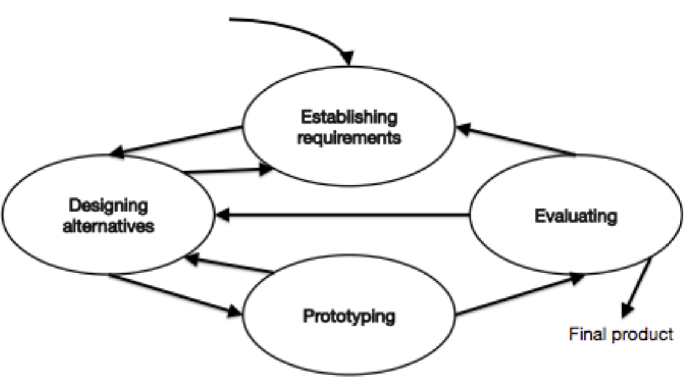
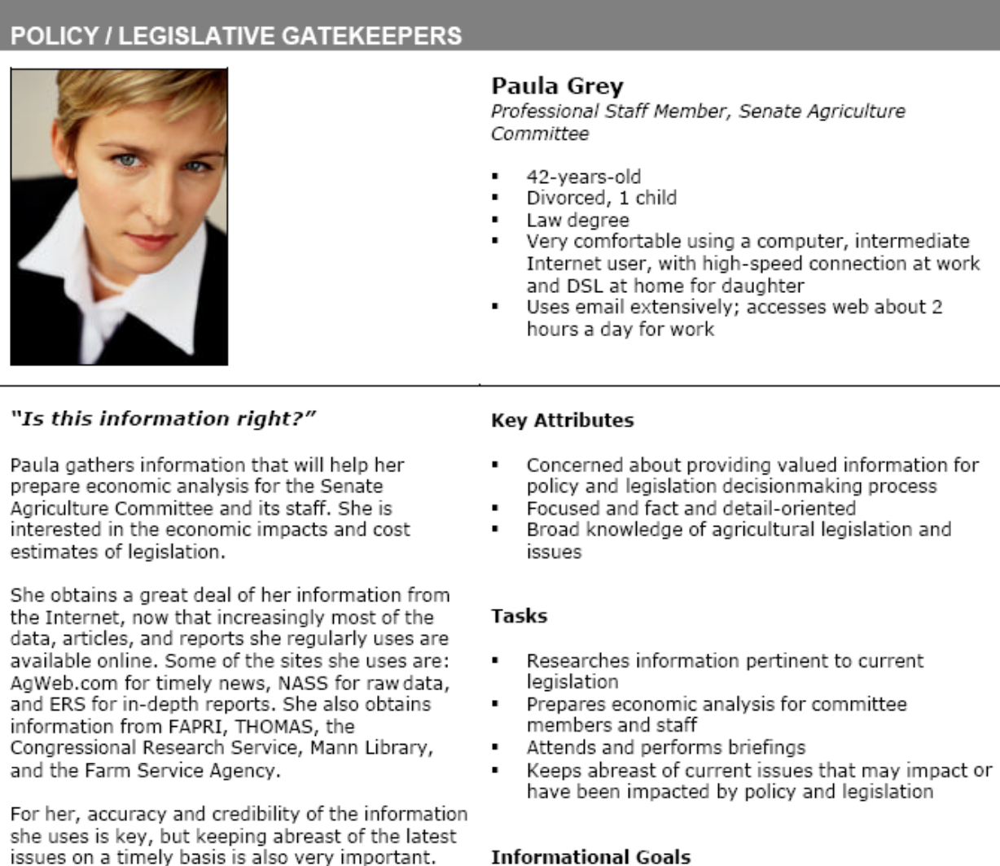
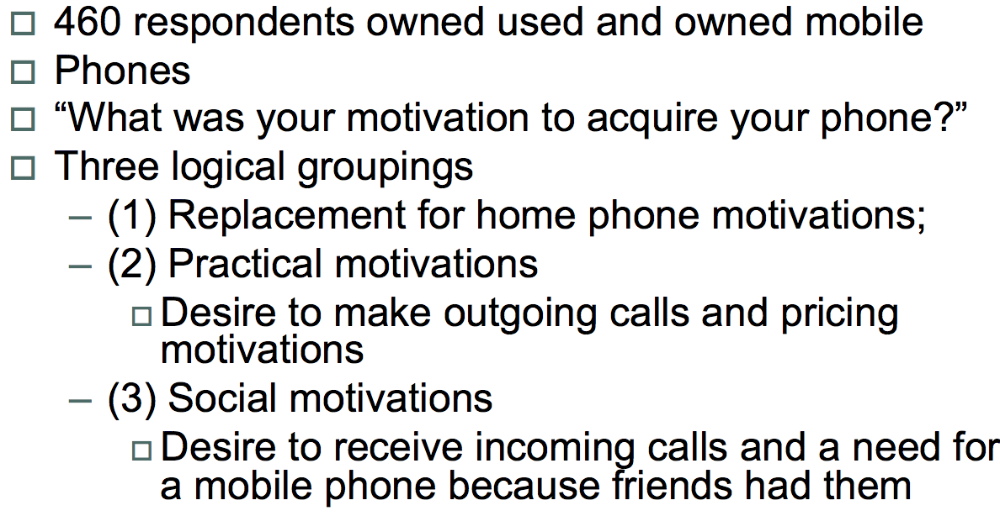
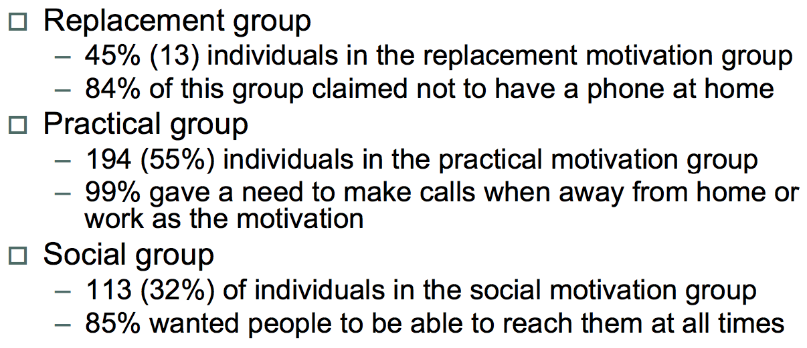
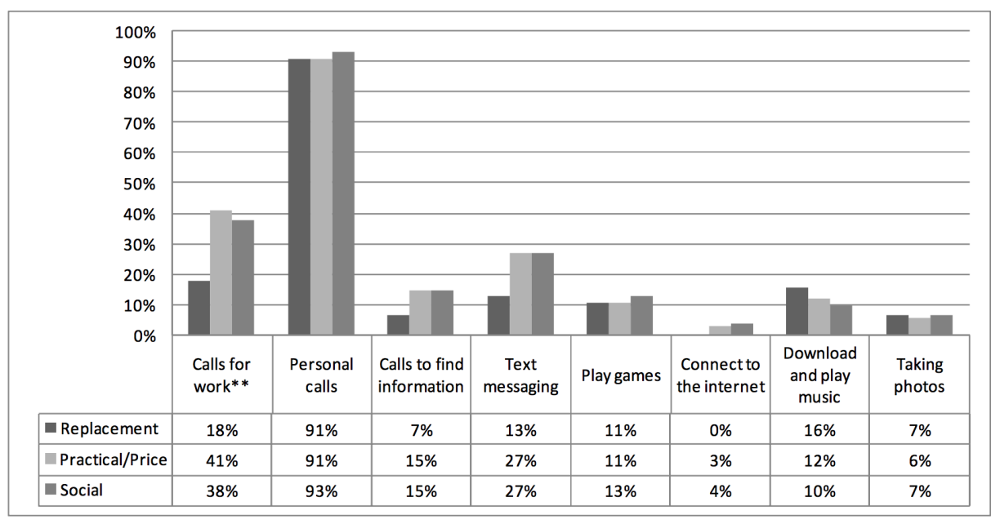

# Requirement
Unambiguous Statement specifying what a product should do or how it should perform.

## Types
* **Functional**: What it should do
  * E.g. Send email on sign up
* **Non functional**: How it should do it/constraints
* **Data and environmental**: Context-dependent requirements based on environment and circumstances the product will operate in
* **User requirements**: Usability and UX goals
  * E.g. Visitor should find a help desk's tabletop engaging

## Acquiring requirements
User research often leads to insight into what users want, part of the iterative design cycle

### Conveying user research results
Those gathering research may not be the same people who build the system, so a commonly understood representation of the research is required.

## Representing requirements

### Personas
* A fictitious character representing a member of a target user group
* Not real people, but their characteristics should be based on data from the gathering stage

* **Purpose**:
  * Capture understanding of target audience to drive design
  * A communication tool between project team members
  * Used to prioritise different system features
* **Audience**: Design team (primary audience), stakeholders and engineers (for context)
* **Context**: Typically occur early in project before detailed design

#### Persona hierarchy
1. Primary/Focal persona
2. Secondary persona
3. Unimportant
4. Affected: Those affected by another persona
5. Anti/Exclusionary persona

A persona's requirements will be prioritised over those of a persona lower in the hierarchy

#### Constructing a persona
1. Collect data about users
  1. Perform research (interviews, focus groups etc.)
  2. Interpret and triangulate common patterns
2. Segment the users
  1. Identify behavioural variables
  2. Map interview subjects to behavioural variables
  3. Identify significant behaviour patterns

  Example
  

  

  

3. Create personas
  * Synthesise characteristics and significant goals
  * Consists of 3 layers
    * Layer 1: Establishing requirements
      * Name
      * Key distinguishing feature
      * Descriptive dimensions
      * Objectives and motivations
      * Source of research (where in data)
    * Layer 2: Establishing relationships
      * Concerns
      * Scenarios and circumstances
      * Quotes from the user
    * Layer 3: Making them human
      * Personal background
      * Photograph
      * System features
      * Demographic info
      * technological ability/comfort level

#### Benefits of using personas
* Represent complex data compactly
* Encourage a user-centred approach
  * Clear vision of the user
  * Brings user to life
* Focuses attention on main user groups
* Avoids
  * Dangerously elastic user
  * Self-referential design
  * Too string focus on edge cases

#### Issues with using personas
* Hard to get right set of personas
* Take long time to develop
  * Temptation to re-use personas
  * Temptation to make them up or use stereotypes
* Shouldn't replace other user-centred methods

### Scenarios
Descriptions of persona's actions or behaviour in particular situations
Useful for understanding details and context of interaction. Highlight some of the needs of your users and the limitations/opportunities for design in the context of use.

Scenarios should:
  * Be concise: Short but complete, breadth instead of depth
  * Include the product: Assume the product exists, even if it doesn't
  * Describe the goal: Reason why we perform the task
  * Be created based on real data gathered
