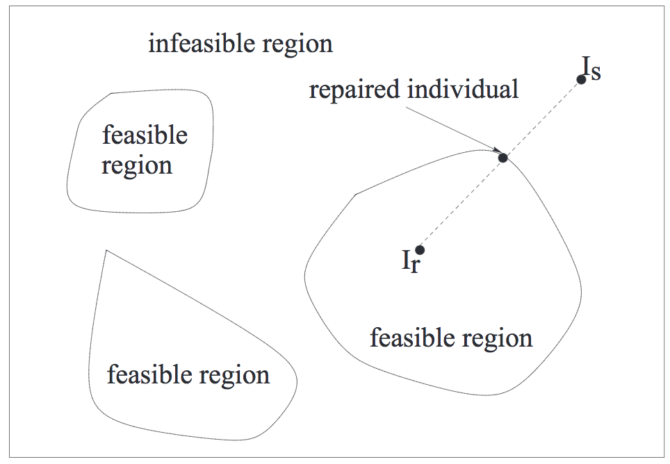

# Constrained optimisation
A problem like the knapsack problem has a constraint on the total weight of all items chosen.
This gives rise to a feasible space of solutions which is a subset of all possible solutions (the search space). `F < S`

## Types of constraints
* Linear
  * Equality
  * Inequality
* Nonlinear
  * Equality
  * Inequality

## Constraint handling techniques
### Penalty function approach
Converts a constrained problem into an unconstrained one by introducing a penalty function into the fitness/objective function.

`NewObjectiveFunction = OriginalObjectiveFunction + PenaltyCoefficient * DegreeOfConstraintViolation`

#### Penalty types
* **Static penalty**: Pre-defined and fixed penalty coefficient during evolution.
  * Simple and easy to implement
  * Requires detailed knowledge of domain
* **Dynamic penalty**: Penalty function changes according to a pre-defined sequence which often depends on the generation number. `Ct`
  * The penalty coefficient can be raised to some power `\a`, which defines the growth rate (linear, exponential etc.)
* **Adaptive and Self-Adaptive penalty**: The penalty function changes adaptively with no fixed sequence to follow.
  * The penalty coefficient depends on the result of the previous generation.
    ```
    \l(t) = 1/B1 * \l(t) if case 1
          = B2 * \l(t) if case 2
          = \l(t) otherwise
    ```
    Case 1: Best individual in last `k` generations were always feasible.
    Case 2: Best individual in last `k` generations were always infeasible.

    `B2 > B1 > 1`

* **Repair approach**: Maps (repairs) an infeasible solution into a feasible one.
  * Move solutions from an infeasible region to a feasible region.
  

    1. Select a reference individual `Ir` from the feasible region.
    2. Create a sequence of candidate individuals `zi` between `Is` and `Ir`
      ```
      zi = ai * Is + (1 - ai) * Ir
      ```
      where `0 < ai < 1` can be generated at random or deterministically, until `zi` is within the feasible region.
    3. Replace `Is` by `zi` with probability `Pr`. Even if `Is` is not replaced by `zi`, its fitness is still that of `zi`)
    4. If `zi` is better than `Ir`, replace it.
* **Purist approach**: Rejects all infeasible solutions in search.
* **Separatist approach**: Considers the fitness/objective function and constraints separately.
* **Hybrid approach**: Mixes two or more other approaches.
