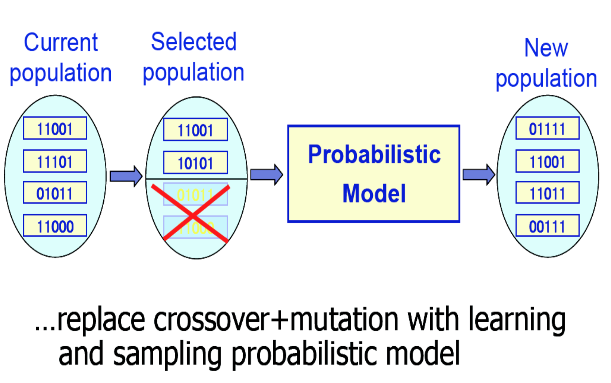
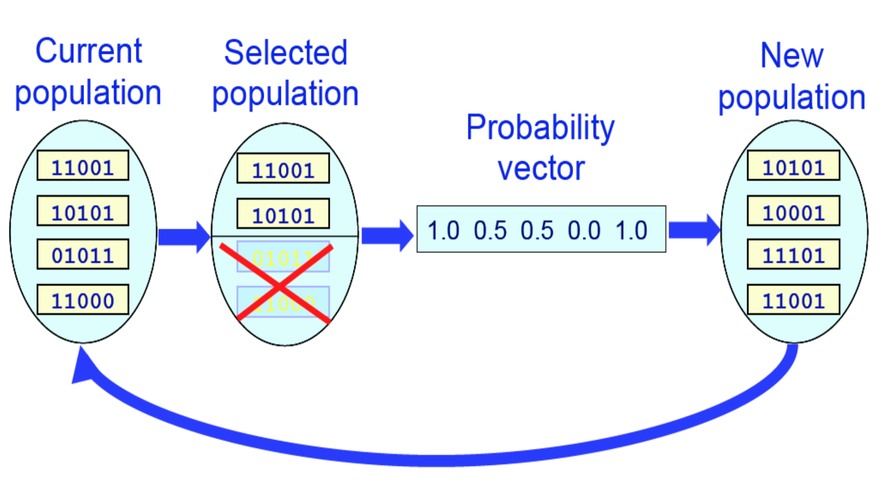
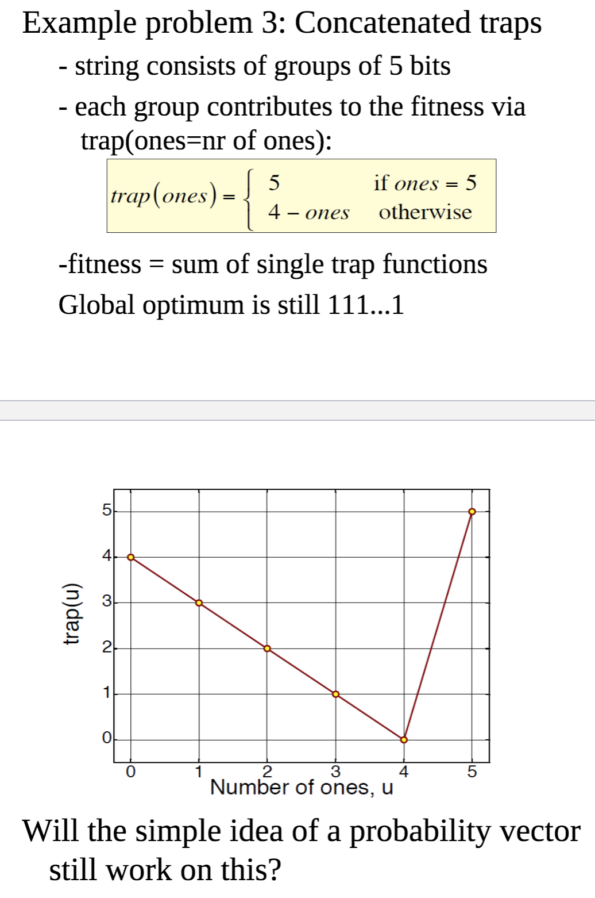
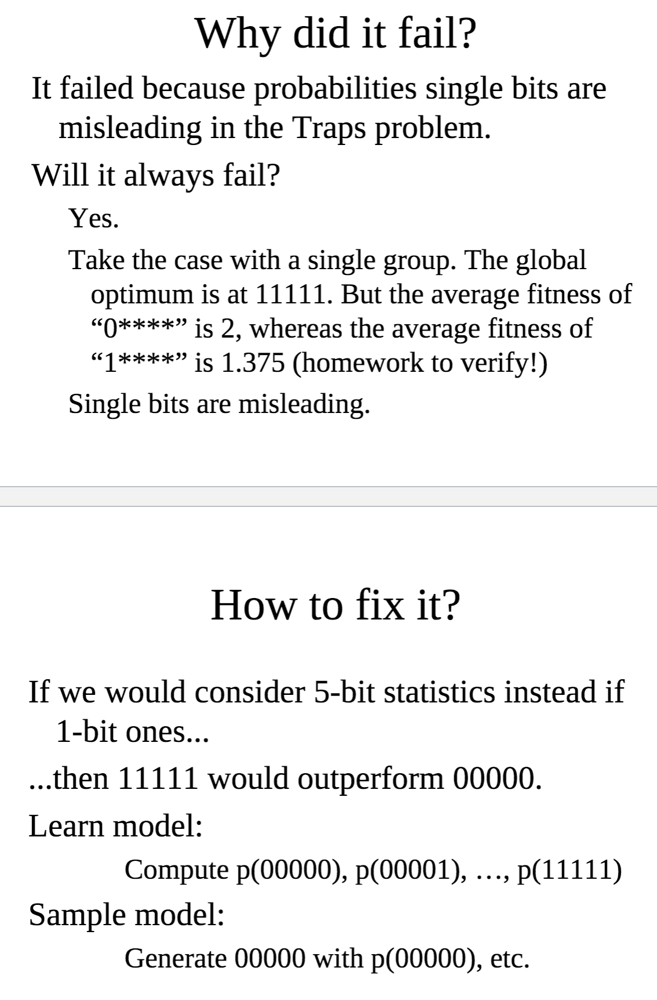

# Estimation of Distribution Algorithms
Replaces search operators with the estimation of the distribution of selected individuals and sampling from this distribution.

Sampling from search space initially occurs uniformly. After fitness is applied to the uniformly selected points, the areas with the best fitness are then selected with higher probability as time goes on.

## Algorithm
1. Generate initial population `P0` of `M` individuals uniformly at random in the search space.
2. Repeat 3-5 for generations `l=1, 2, ...` until some stopping criteria.
3. Select `N <= M` individuals from `P(l-1)` according to a selection method.
4. Estimate the probability distribution `pl(x)` of an individual being among the selected individuals.
5. Sample `M` individuals (the new population) from `pl(x)`

## Probabilistic model
Different EDA approaches according to different ways to construct the probabilistic model. Simplistic and doesn't take context of other parts of the genotype into account.

### Example
`pi` = probability of `1` in position `i`, learn `p` then sample `p` for the new population. a problem is that if you encounter a situation where a member of the probability vector is 1 (i.e all individuals in the selected population have 1 in the 1st bit), all future offspring will have follow (all will have a 1 in the 1st bit).

## Population based incremental learning (PBIL)
A probability vector can be updated when new individuals are generated by:
`p = \l * p + (1 - \l) * x` where `\l` is the learning rate.

## Compact genetic algorithm (CGA)
Hold a competition between two individuals. For each bit in the winner's genotype, increase that bit's probability in the probability vector if it's 1, or decrease if it's 0. DO this by a constant amount.

## Univariate marginal distribution algorithm (UMDA)
Sum all the bits for fitness value, good for problems where each bit should be a 1. Works well when a bit is independent of other bits.

### Example

# Conclusion
* With a good probabilistic model it can improve over conventional EAs (somehow)
* An additional advantage is the provision of a series of probabilistic models that reveal a lot of information about the problem
