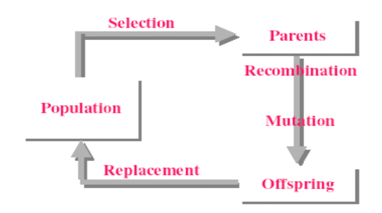
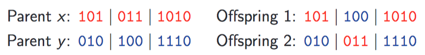

# Genetic algorithms

1. **Initialisation**: Generate initial population (generation) `P(0)` at random.
2. **Iteration**:
  1. Evaluate fitness of individuals in `P(i)`
  2. Select parents from `P(i)` based on their fitness
  3. Generate offspring from parents using crossover and mutation to form `P(i+1)`
    * **Mutation**: Flip random bit, or each bit can flip with some probability
    * **Crossover**: Perform bitwise-or on parents
3. **End**: Stop when some stopping criteria are satisfied or enough time has passed

If the population is of size 1, do following process instead

1. **Initialisation**: Pick a random x
2. **Iteration**:
  1. Mutate x to y
  2. If y is better than x then set x to y
3. **End**: Stop when some some stopping criteria are satisfied or enough time has passed

Often several runs are done as the process is non-deterministic. Average or best of all runs is taken as final result.

## Example
Maximising the function `f(x) = x^2` within the range `{0, ..., 31}`.

Each number is represented as its binary string, where the binary string is the genotype and the number it represents is the phenotype.

1. **Initialisation**: The initial population of numbers is generated at random
2. **Iteration**:
  1. Their fitness is evaluated according to `f(x)`
  2. Select 2 individuals for crossover based on their fitness e.g. by using the 'roulette-wheel sampling' to implement a [fitness-proportionate selection](https://en.wikipedia.org/wiki/Fitness_proportionate_selection)
3. **End**: Stop when a maximum value is reached

## Variables to adjust
* Representation design
* Size of the population
* Probability of crossing over at a randomly chosen locus
* Probability of mutating a gene
* Selection strategy used e.g. fitness-proportionate selection

## Exploration and exploitation
Exploration of new parts of the search space is done by
* Mutation operators
* Recombination operators

Exploitation of promising genetic material is done by a selection mechanism

### Mutation operators for binary strings
The mutation operator introduces small, random changes to an individual's chromosome

In local mutation, one randomly chosen bit is flipped. In global mutation, each bit is flipped with some probability called the __per bit mutation rate__ (`pm`), which is often `1/n` where `n` is the chromosome length. `P[k bits flipped] = nCr(n, k) * pm^k * (1 - pm)^(n-k)`

### Recombination operators for binary strings
Recombination operators generate an offspring individual whose chromosome is composed from the parents' chromosomes. The __crossover rate__ is the probability of applying crossover to parents.

#### One point crossover
Randomly select a crossover point `p e {1, 2, ..., n}` and join the parents' (`x` and `y`) chromosomes at this point.

Offspring 1 is `x1, ..., xp` union `y(p+1), ..., yn`

Offspring 2 is `y1, ..., yp` union `x(p+1), ..., xn`

#### K-point crossover
Randomly select `k` crossover points `p1 < ... < pk in {1, 2, ..., n}`

Offspring 1 is `x1 ... xp1` union `y(p1+1) ... yp2` union `x(p2+1) ... xp3` etc.
Offspring 1 is `y1 ... yp1` union `x(p1+1) ... xp2` union `y(p2+1) ... yp3` etc.

## Real value representation and recombination

Recombination through average value of parents

Geometric and quadratic recombination

