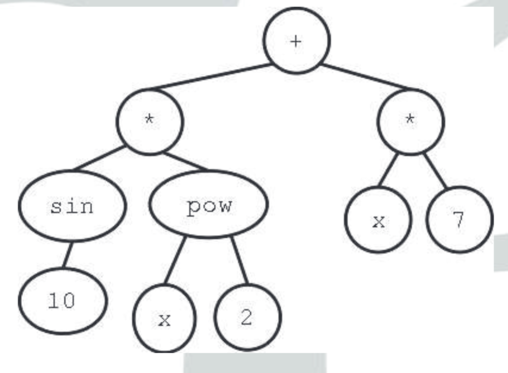

# Genetic programming

## Content view
* Automatic programming
* Creation of programs by artificial evolution

## Representation view
* Anything using a tree representation
* May be programs or other things

## Representation

### Trees
* Local data storage as a stack
* Trees as the genotype
* Tree genetic operators

#### Crossover
* Branch swap
  Pick random branch from each parent and swap
  
* Matched 1-point crossover
  

#### Mutation
* Branch replacement
  Pick a random branch from the parent and replace it with a new randomly generated branch

#### Population creation
* Approach 1
  1. Add random function nodes until all branches have the predefined treeDepth - 1
  2. Add random terminal nodes to all branches
* Approach 2
  1. Add random function or terminal nodes until all branches have terminals that or are the predefined maxDepth - 1 deep
  2. Add random terminals to all branches without terminals
* Approach 3
  

#### Bloat
* Program size grows
  * As a result of uneven crossover
  * Results in unused code
  * Slows down execution
  * More space and CPU time required
  * Mutation and crossover of unused code results in offspring with identical behaviour
* Countermeasures
  * Incorporate program size into fitness
  * Use special crossover (e.g matches 1-point crossover)
* Manual simplification
  * Get rid of unused branches
  * Transform into its most compact form
  * Convert real-valued terminals into parameters

### Linear
* Series of instructions and data in a Von Neumann machine
* Registers for data storage
* Variable-length usually
* Mutation through

### Graphs
* Nodes contain instructions
* Edges control program flow
* Stack for memory
* Control mechanism controls which edge to follow, depending on value written to stack (< 0, = 0, > 0)
* Looping and recursion are common
* Similar to how the JVM pops and pushes operands along with instructions

## Example: Symbolic regression

### Tree representation

The terminal set consists of constants and variables (those that don't consist of other nodes). The function set consists of other nodes:
* Control structures
* Mathematical functions
* Boolean functions
* Etc.

Functions must be defined for all inputs (even division by 0).

## Applications
* Regression
  * Chemistry
  * Engineering
  * Statistics
  * Data mining
  * Intrusion detection
  * Image classification
* Control
  * Plants
  * Robots
  * Spacecraft altitude manoeuvres
  * Animation
* Design
  * Neural networks
  * Electronic circuits
