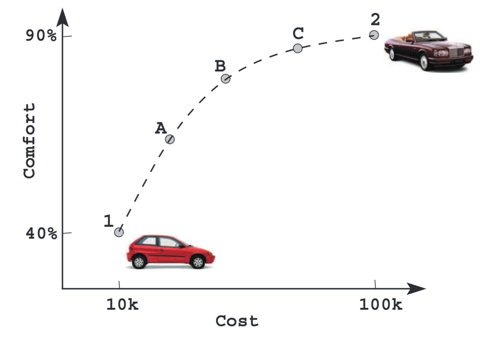
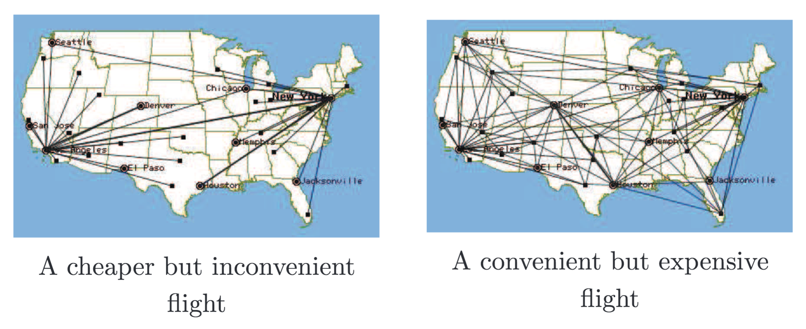
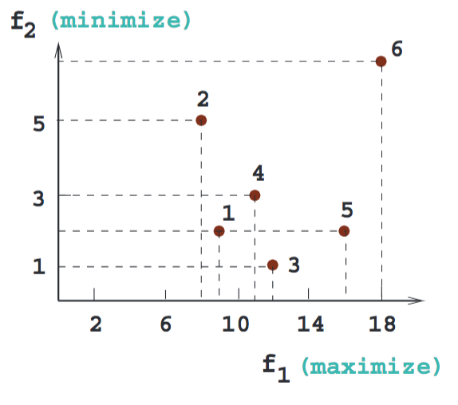
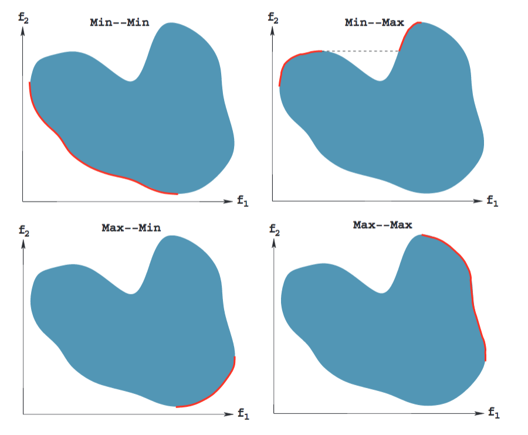

# Multi-objective optimisation

Finding a solution based on multiple factors (objectives).

`x^1` dominates `x^2` if:
1. `x^1` is no worse than `x^2` in all objectives
2. `x^1` is strictly better than `x^2` in at least one objective

The population approach of evolutionary algorithms suits finding multiple solutions. Niche-preservation methods can be used to find diverse solutions.

## Pareto-Optimal solutions
Among a set of solutions `P`, the non-dominated set of solutions `P'` are those that are not dominated by any member of the set `P`. When `p = S`, the resulting `P'` is a Pareto-optimal set.

### Finding the non-dominated set
1. Set `i = 1` and create an empty set `P'`
2. For a solution `j e P` (but `j != i`) check if solution `j` dominates solution `i`. If yes, go to step 4
3. if more solutions are left in `P`, increment `j` by one and go to step 2, otherwise `P' = P' u {i}`
4. Increment `i` by one. If `i <= N`, go to step 2, else stop and declare `P'` as the non-dominated set.

`O(M * N^2)` complexity

### Pareto-optimal fronts

Each front relates to a combination of either maximising or minimising each objective.

## Preference-based approach
One approach finds one solution based on predefined objective weights (high-level information). An ideal solution finds the Pareto front that maximises/minimises the appropriate objectives, then high-level information is given to choose one from that front.

???

## Elitist
[Read again](https://canvas.bham.ac.uk/courses/27617/files/4947584?module_item_id=865924) and watch Panopto from 27/02/18
Choosing best individual from offspring and parents.

## Non-elitist
Choosing best individual from offspring only. If the mutation rate is `1/N` then there is a 0.99 chance of producing an offspring that is a clone of one or more of its parents.
