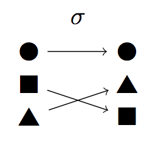

# The No Free Lunch theorem
Let `X, Y c R` be finite sets, and let `F` be the set of all function `f : X -> Y` which is **closed under permutation**.

Then for any black box optimisation algorithms `A` and `B`

```
E[T(A, F)] = E[T(B, F)]
```

The average case runtime over `F` is the same for all black box optimisation algorithms.

## Closed under permutation
If a function `f` is in class `F` then any permutation `\s`, function `f o \s` is also in `F`. Permutation = mapping over elements, each element mapped to another.



[Page 9](https://canvas.bham.ac.uk/courses/27617/files/5131903?module_item_id=892742)
