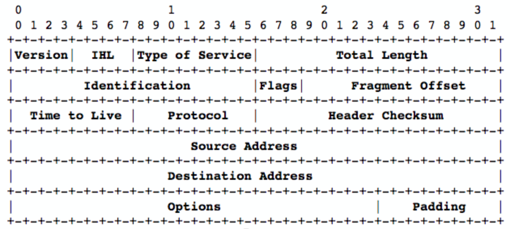
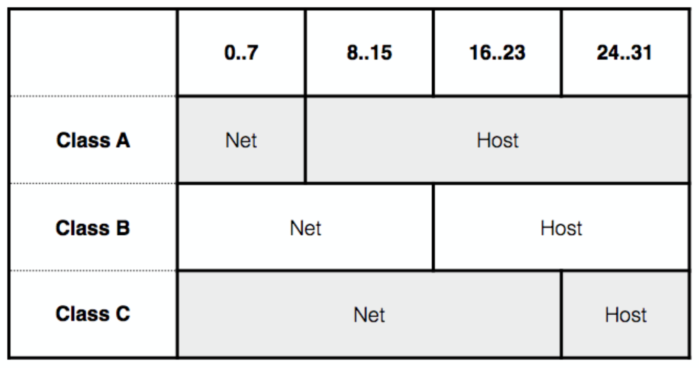

# IP
Dominant networking protocol that works on over a single network layer.

* An unreliable, un-sequenced datagram service where you put an address on a packet and the network makes an attempt to deliver it somewhere, hopefully the right place.

## Packet format
Each packet is 4 bytes long, the Options bits are optional (surprise eh), and the format isn't byte-aligned (#1980sproblems)

## Notation
IP addresses are written as 4 decimal numbers, each separated by dots. Typically aren't zero-padded, i.e 192.168.1.1 rather than 192.168.001.001. Hex would have been better but came along later.

## Routing
All IP addresses identify a network (leftmost part of address) and the host on that network (rest of address).
If the address host refers to this router, process the packet and send it to the correct device, else lookup the network in a routing table and choose an interface believed to be closer to the destination address and send it.

Routing loops can occur (router A thinks a packet should go to router B, who thinks it should go to router A). This can be somewhat mitigated by introducing a time-to-live field (TTL) to the packet, which is decremented each time it gets to a router. If it arrives with a TTL of 0, then the packet is thrown away. The packet sender should initialise the TTL with a sensible value representing the expected maximum number of routing jumps. A typical value for the modern internet is something from 30-60.

## Classful addresses
If the address starts with 0, the first 8 bits identify the network and the remaining 24 identify the host on the network.

This gives 128 "Class A" addresses to large sites that get 2^24 hosts each. These went to MIT, BBN, Ford, DEC, Boeing and the UK government.

If the address starts with 10, the first 16 bit identify the network, the remaining 16 bits the host on that network. 128.x.y.z through to 191.x.y.z. Gives 2^14 "Class B" addresses with 2^16 hosts each. Initially easy to get for smaller universities and companies.

If the first bits are 110, the first 24 bits identify the network and the remaining eight the host on the network, 192.x.y.z through to 223.x.y.z. Gives 2^21 "Class C" addresses with 2^8 hosts per network.

Remaining space was used for multicast ("Class D", 224.x.y.z through to 239.x.y.z)

### Wasteful allocation
The total reachable space is 87% of available addresses. No university has 16 million hosts, so the Class A and B space is sparsely occupied.

## Sub-netting
Slide 19: https://canvas.bham.ac.uk/courses/27275/files?preview=4298342

## IPv6
Slide 28: https://canvas.bham.ac.uk/courses/27275/files?preview=4298342

## IP on ethernet
On ethernet (or other point to multi-point), how do we find the MAC address of the next jump?

### ARP (Address Resolution Protocol)
IPv4 uses ARP
* Simple, old and very insecure
* The ARP sender asks who has a particular IP number
* A machine can claim to have that IP and pose as a router to sniff all traffic

IPv6 uses the Neighbour Discovery Protocol

## IP over point-to-point
Packets are just send to the other side of the link as there's only one possible receiver

## IP address allocation
Small allocations come from the ISP and belong to the ISP. Larger "provider independent" allocations can be obtained from regional registries (although you need to make a very good case for it). When you change ISP you'll need to change your public IPs.

## Local IP allocation

### Static allocation
An end point is given an IP which is then written to a config file/memory. Each time a device boots, it gets that IP even if it clashes with another device on the network. The machine might notice that it is a duplicate but there is very little protection.

Essential for routers and infrastructure devices that need to be up in the early stages of power failure. Often used for servers that have fixed addresses.

### Bootp
Device broadcasts its ethernet address and gets an IP number back from some "bootp server". Normally configured with a large table statically mapping MAC to IP.

There's no way of reclaiming addresses.

### DHCP (Dynamic Host Configuration Protocol)
Provides a means to lease a temporary IP number for some duration. Can be used to inform devices of statically allocated IP numbers.

#### Initial operation
1. **DHCPDISCOVER**: Client broadcasts an IP number request including its MAC
  * If the IP matches what the server offered, they know the client is using the offered IP and so locks the offered IP for the duration of the lease
  * If it doesn't match (e.g MAC is no one they've made an offer to, or claimed IP is different) then they do nothing
  * A client can directly send a request to a known server to renew a lease
  * Conventionally, renewal attempts start after half the lease time has passed
2. **DHCPOFFER**: Server reserves an available IP number and broadcasts an offer of it with a lease time (how long it's valid for)
3. **DHCPREQUEST**: Client chooses from offers and broadcasts reply with chosen number
4. **DHCPACK**: Server finishes reserving it and acknowledges

#### DHCP Redundancy
* Loss of a DHCP server will wipe out the network as IPs can't be renewed
* Simple home routers can be careless about this and restarting a router may require restarting client devices so they reach an agreed state of IPs

##### Redundancy choices
* Having two DHCP servers with distinct pools of IP addresses and let client choose between them
* Complex failover protocol so both servers make the same offer and commit to the same lease for IP state synchronisation
* Virtual servers with high-level redundancy protocols
* Active and standby server where standby server only takes part in IP negotiation if the client requests are desperate (DHCP requests can have a field that represents how many times the request has been attempted)

#### Problems with DHCP
* Failure is a serious problem
* Nightmare to debug
* Relays in complex network are very complex

##### DHCP Relaying
* Relay agent on each network, usually embedded in a router
* Contains no state so can be safely replicated and have multiple running at once
* Operation is messy though

See from slide 16 [here](https://canvas.bham.ac.uk/courses/27275/files?preview=4298349)
for more info.

### IPv6 Address allocation
See from slide 26 [here](https://canvas.bham.ac.uk/courses/27275/files?preview=4298349)
for more info.
