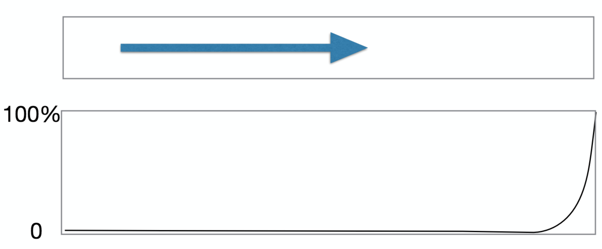

# Lower layers

## Network types
* **WAN**: Wide Area Network
* **LAN**: Local Area Network
* **MAN**: Metropolitan Area Network

Historically, WANs were very slow. A fast long-haul network of the 1980s might have a speed of a few tens of kilobits per second. Huge monopolies controlled

The tech existed to go faster, but was expensive and there was a lack of demand.

LANs were hitting 10 Mbps by 1980 and 100 Mbps by 1990.

## WANs
Connected computers together more than 1km apart.

Main applications:
* File transfer (format conversion issues as even the byte-size could vary)
* Job transfer (national facilities for super computers, batch mode)
* Remote login

## Packet switching and circuits

### Packet switching
Each packet contains a complete destination information. A router looks at incoming packets, decides where to send it and sends it on its way.

### Virtual circuits

## Ethernet
Developed by Metcalfe and Boggs at Xerox Palo Alto in 1970s. Named after the luminiferous aether that supposedly carried light and radio until disproved by the Michaelson-Morley experiment.

Only one station can transmit at a time, so they wait until there is no traffic then start transmitting (raises collision problems).

As a station transmits, it listens to the ether and checks the ether only contains the signals that it sends. If there's a mismatch, then we know that someone else is transmitting at the same time. Done in hardware.

### When collosions happen
Network is jammed (send a set pattern so all stations know a collision is in progress). It's critical that the whole ether knows about the collision before the packet has finished being sent. Maximum packet size if 64 octets (based on maximum diameter of collision domain 1.5km). Jam pattern is padded to this length.

### Recovery from collisions
* On the first attempt, choose a random number k from {0, 1} and delay k * 512 bit periods before trying again
* On the nth attempt, choose a random number k from {0 .. 2^n} and delay k * 512 bit periods before trying again
* After 10 attempts, give up

The random numbers don't have to be cryptographically secure, just different from each other.

Collision rate increases exponentially with load and cable population.

### Topology
Originally a bus topology: single cable with computers connected to it. The early versions are 3 Mbps. Max length is 500m, but can be amplified and regenerated to go to 1.5km.

### Format
* 7 bytes of preamble (0x55) to allow receivers to synchronise
* 1 byte of frame delimiter (0x5d)
* 6 byte source address
* 6 byte destination address
* 4 byte VLAN tag (optional and modern)
* 42 - 1500 bytes of payload
* 4 byte CRC
* 12 byte inter-packet gap

### Problems
* Heavy, expensive and difficult to install (minimum bend radius requirements)
* Installing taps for transceivers involves drills and risks damaging the cable
* Transceivers add cost and complexity
* Performance issues in background

### 10BaseT
Modern ethernet cables (twisted pair).
Links a machine to a hub

* **Repeater**: An amplifier, only sees the voltage

* **Bridge**: Receives, buffers and transmits frames, so collisions are propagated

  * __learning__ and __filtering__ bridges only send the frames that belong on the other side, other bridges just send everything.

  

* **Hubs**: Are repeaters
* **Switch**: A set of learning bridges. Worsen latency
* **Cut-through switches**: Wait for ethernet header, then start streaming bytes straight away, instead of waiting for entire packet like a normal switch. Less latency impact but propagates broken packets

### 100BaseT
10x the speed of 10BaseT, made possible switching. The increase in speed worsens collisions (prevented by full duplex).

#### Full duplex
Traffic goes in and out without colliding as each direction is a separate collision domain.

Large buffers internally deal with congestion, preventing collisions.

##### Random early drop
When the buffer is full, packets are dropped as they can't be put anywhere. To mitigate dropping 100% of the packets that can't be accommodated, the switch will start to drop packets as the buffer fills, with the chance of dropping increasing as it fills. The stations detect the dropped packets and slow down transmission.

## Token Ring/Bus
See slide 40 [here](https://canvas.bham.ac.uk/courses/27275/files?preview=4298343)

## Slotted Rings
See slide 47 [here](https://canvas.bham.ac.uk/courses/27275/files?preview=4298343)

## ATM
See slide 47 [here](https://canvas.bham.ac.uk/courses/27275/files?preview=4298343)
