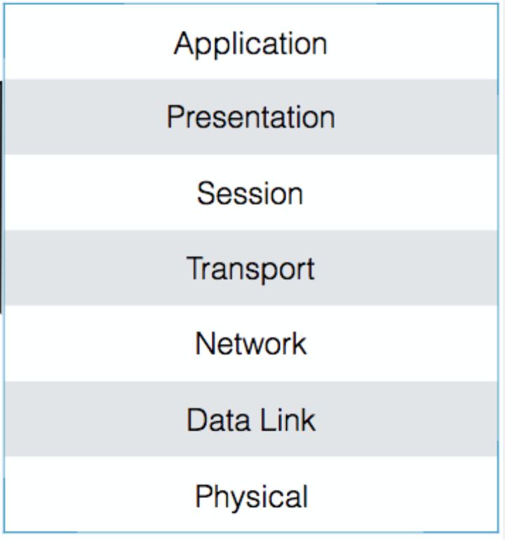
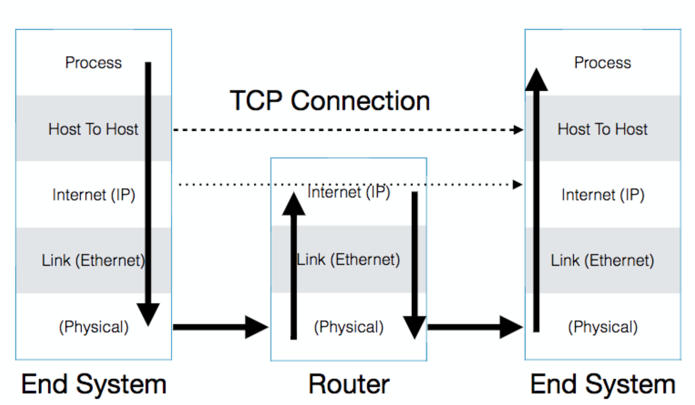

# OSI
Open Systems Interconnect. Failed project to build a standard suite.


# DoD Model
(Department of Defence)


# Layer encapsulation

Each layer adds a header and trailer, which are stripped off at the other end.
```
Ethernet Header | IP Header | TCP/UDP Header | Data | TCP/UDP Trailer | IP Trailer | Ethernet Trailer
```

# Layer hardware
* **Switches**: Understand the link layer. Switch ethernet packets between links
* **Routers**: Understand the IP layer and move packets between potentially very different links
* **Hosts**: Understand the transport and application layers, usually general purpose computers
