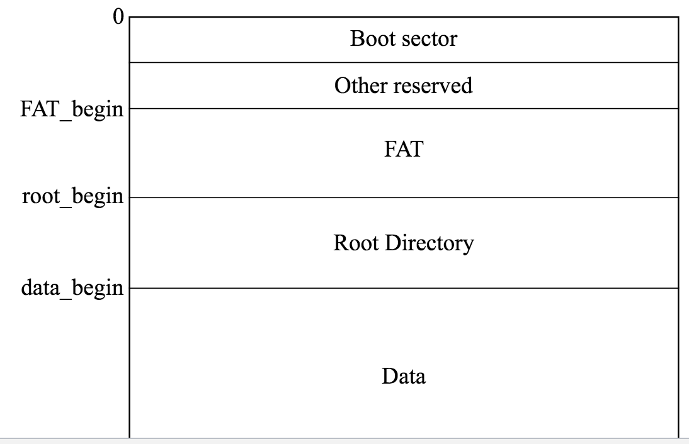
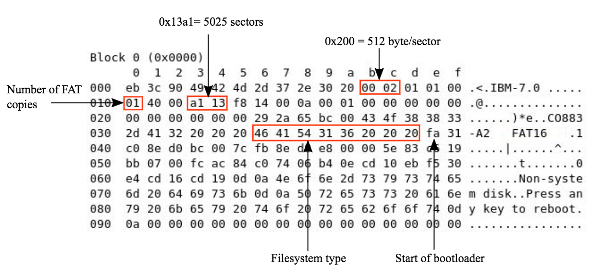
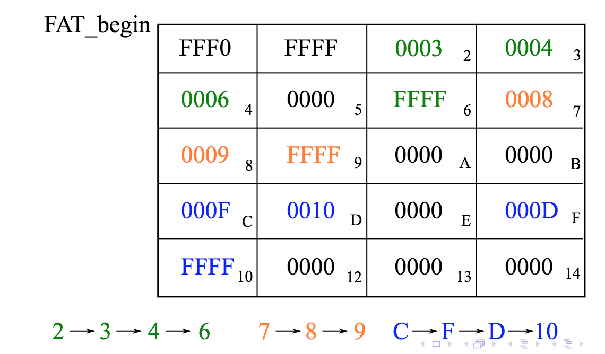

# Filesystems
* **Logical view**: Tree structure of files and directories, each with a read/write/create operation.
* **Physical view**: A sequence of blocks, which can be read from and written to. The OS must map the logical view onto the physical view and assign blocks to files.

Two main approaches:
* **Linked list**: Each block has a pointer to the next. Random access is costly as you have to go through the whole file until finding the desired position.
* **Indexed allocation**: Store pointers in one location: so-called index block (Similar to a page table)

## FAT (File allocation table)
The variants (*FAT12*, *FAT16* etc. define the number of bits per FAT entry). Here we focus on FAT16.

* **Sector**: Disk unit (e.g 512 bytes), a.k.a block
* **Cluster**: Multiple sectors (1, 2, 4, ..., 128)
  Here we assume that a cluster is 1 sector

Uses a linked list to group clusters (a *cluster chain*)

FAT16 bootsector

### Link table
The FAT stores the links between blocks of the drive. Each entry stores a pointer to the next logical entry.

See [slide 10](https://canvas.bham.ac.uk/courses/27276/files/folder/Slides?preview=4690032) for more example images

### FAT limits
* Max volume size of 2GB (16 bits per entry with 32kB clusters)
* Max file size of 2GB
* Max number of files (32 kB clusters)
* Max filename length of 11 characters (8 + 3 for extension)
* Later version of FAT (e.g. *FAT32*) have higher limits

## Caching
Some disk blocks used to store recently used directories or files can be cached in main memory, with them periodically written back to disk. Introduces inconsistency when the system crashes (a reason why computers must be shutdown properly).

### Journaling filesystems
*Transaction points* are defined at which the cache is written to disk. A log-file is kept for each write operation, which keeps enough information so that any uncommitted changes after the latest transaction point can be unraveled.

## Disk access
* **Seek**: Head moves to appropriate track.
* **Latency**: Correct block is under head?
* **Transfer**: Data transfer

With HDDs, the time used to seek and for latency dwarfs the transfer time -> Distribution of data and scheduling algorithms have vital impact on the performance of HDDs, less so for SSDs.

## Disk scheduling
The standard scheduling algorithms apply, adapted to the special situation.

* **FCFS**: Easiest to implement but may require lots of head movements (which are expensive).
* **Shortest seek time first**: Select job requiring minimal head movement.
  * May cause starvation
  * Tracks in the middle of the disk are preferred
  * Doesn't minimise number of head movements

## Virtual filesystem
Implemented in Linux to ensure interoperability with Windows and Mac.

Uses a *virtual filesystem* which maintains:
* **inodes**: For files and directories
* **caches**: In particular for directories
* **superblocks**: for filesystems

All system calls (*open*, *read*, *write* and *close*) all go through the VFS first. If necessary, the VFS selects the appropriate operations on the real file system.
