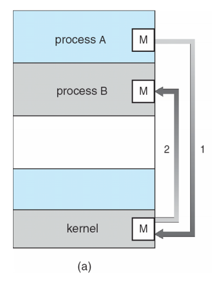

# Inter-process communication
Processes in a system can be independent or cooperative. Cooperative processes can affect or be affected by other processes.

## Reasons for using cooperative processes
* Sharing information
* Computation speed-up (depending on hardware)
* Modularity
* Single-responsibility principle

## IPC models
Cooperating processes need some method of IPC

### Message passing

Processes communicate with each other without resorting to shared memory.

The IPC system in the OS provides two operations:
* _send(message)_
* _receive(message)_

If two processes wish to communicate, then they have to:
* Establish a communication link between them
* Exchange messages via _send_/_receive_

#### Implementation
* **Physical**: Shared memory or hardware bus
* **Logical**: Abstract channel that may use physical technology, such as ethernet or wireless and protocol layers, such as IP, UDP, TCP

#### Direct communication
Under direct communication processes must name each other explicitly
* _send(P, message)_
* _receive(Q, message)_

* Links are established automatically and are associated with exactly one pair of processes
* Between each pair there exists exactly one link
* Link may be unidirectional but may be bidirectional

Suffers from a lack of modularity as process name/IDs must be known.

#### Indirect communication
More flexible and so more common. Messages are sent to and received from mailboxes.

Each mailbox has a unique ID. Processes can only communicate if they share a mailbox (i.e if they know the mailbox ID)

* Link established only if the processes share a common mailbox
* A link may be established with many processes
* Each pair of processes may share several links
* Link may be unidirectional or bidirectional

Operations
* _create()_: Creates a mailbox and returns its ID
* _send(A, message)_: Sends a message to mailbox _A_
* _receive(A, message)_: Receives a message from mailbox _A_
* _destroy(A)_: Destroy mailbox _A_

##### Sharing
* _P1_, _P2_, _P3_ share mailbox _A_
* _P1_, sends. _P2_, _P3_ receive
* Who gets the message - _P2_ or _P3_?

Solutions:
* Allow a link to be associated with at most two processes
* Allow only one process at a time to execute the receive operation (hmm... locking needed?)
* Allow system to arbitrarily select the receive. Sender is notified who receiver was

#### Synchronisation
Message passing may be either blocking or non-blocking. If both sending and receiving are blocking, we get a **rendezvous**.

##### Blocking
Considered synchronous
* Sender blocks until message is received
* Receiver blocks until a message is available

##### Non-blocking
Considered asynchronous
* Sender sends message then continues
* Receiver receives a message or null

#### Buffering
Queue of messages attached to link, implemented in one of three ways
* **Zero capacity**: 0 messages (a.k.a rendezvous). Sender must wait for receiver
* **Bounded capacity**: Finite length of `n` messages. Sender must wait if buffer is full
* **Unbounded capacity**: Infinite length. Sender never waits
