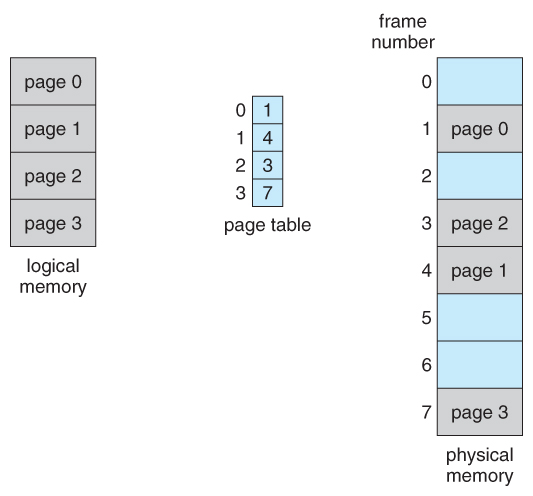

# Memory management

## Memory mapping
A program and the hardware both see memory as a set of memory cells starting at address 0x0. A program's addresses (logical addressing) don't always correspond to the same address in hardware (physical addressing). Logical addresses are mapped to physical addresses

The mapping can be made at:
* **Compile-time**: Absolute references are generated, restrictive
* **Load-time**: ??
* **Execution-time**: Needs hardware support

Dynamic linking makes one copy of a system library available to multiple processes to avoid it being unnecessarily re-copied.

## Virtual memory (swapping)
If memory demand is too high, the memory of some processes is transferred to disk. When combined with scheduling, the memory of low priority processes is swapped out.

## Fragmentation
Swapping raises two problems:
* **External fragmentation**: Many small holes appear in memory. If 1GB of space is spread across two (non consecutive) holes and a new process requires 1GB, the occupied space in between needs to be moved.
* **Internal fragmentation**: wtf is this

Strategies for choosing holes of memory:
* **First-fit**: Start from beginning and use first available hole
* **Rotating first-fit**: Like first-fit but start from last assigned part of memory
* **Best-fit**: Find the smallest usable space
* **Buddy system**: Memory is split into a binary tree. The capacity of a node in the tree is the sum of its children.

## Paging
Memory is split into segments of the same size, avoiding external fragmentation. The translation between logical addresses and physical addresses is done via a page table. De-fragmentation is simpler as segments can be moved around since they are all the same size (page table is updated to point to new physical address). By default, one segment is assigned to one process.

## Segmentation
Dividing memory according to its usage by programs:
* **Data**: data used by program, mutable, different for each instance
* **Code**: immutable and same for each instance of the program
* **Symbol table**: immutable, same for each instance and only used for debugging

## Demand paging
Virtual memory implemented as demand paging: memory divided into units of the same length (pages), together with an invalid/valid bit.

Decisions to be made:
* Which process to swap out (move move process' memory to disk while halting the process)
* Which pages to move to disk when an additional page is required (done by pager)

Minimising the rate of page faults (when a page has to be fetched from memory) is crucial.

### Page replacement algorithms
* **FIFO**: Easy to implement but doesn't take locality into account. An increase in number pages can cause increase in rate of page faults (Belady's anomaly)
* **Optimal algorithm**: Select page which will be re-used at the latest time (or not at all). Not implementable (lol) but good for comparisons
* **Least-recently used**: Replace page which has been unused for the longest time
* **Second-chance algorithm**: Hardware sets reference bit to 1 when page is referenced. Now use the FIFO algorithm, but skips pages with reference bit 1, resetting it to 0.

## Thrashing
If a process lacks pages that it uses constantly, the page fault rate will be high. The CPU throughput decreases dramatically and performance suffers.

Solutions:
* **Working-set model**: Define the working set as a set of pages used in the most recent change in page references. Keep only the working set in memory. Achieves high CPU-utilisation and prevents thrashing.
* **Page-fault frequency**: Give additional pages to processes with high page fault frequency, and fewer pages to processes with low page fault frequency.

## Kernel memory
There are separate logical addresses for the kernel and for user memory.

In a 32-bit arch, the kernel space addresses are the upper 1GB and the user space addresses are the lower 3GB. Kernel memory is protected against access by user processes.

In a 64-bit arch, the kernel has the upper half of addresses and the user the lower half.

## Page caches
It is common to have repeated cycles of allocation and freeing the same kind of objects. There can be a pool of pages used as a cache for these objects (slab-cache). Maybe they
