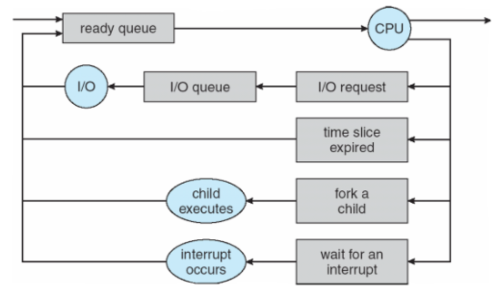
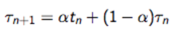
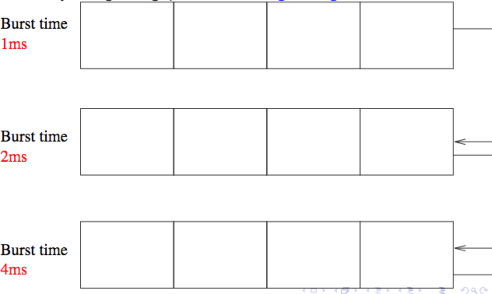

## Schedulers

Composed of queues, between which processes migrate.
* **Job queue**: all processes in system
* **Ready queue**: all processes in main memory ready and waiting to execute
* **Device queues**: processes waiting for I/O device

Types of schedulers
* **Short term**: Invoked frequently (milliseconds), must be fast
* **Long term**: Invoked infrequently (seconds, minutes), can be slow. Swapper is such
  * Controls the degree of multiprogramming (how many processes may compete for the CPU)
  * Typically minimal or absent on mainstream OSs, such as Windows and Linux.

Processes can be described as
* **I/O bound**: Spends more time doing I/O than computations, many short CPU bursts
* **CPU bound**: Spends more time doing computations, few long  CPU bursts

### Choosing process to execute on the CPU
Prerequisites for successful scheduling
* **CPU-I/O burst cycle**: Experience shows that I/O occurs after a fixed amount of time in >= 90% of programs. This forms an appropriate time for re-scheduling
* **Preemptive scheduling**: Processes can be forced to relinquish the CPU.

There are various, often conflicting, criteria to measure the success of scheduling
* **CPU utilisation**
* **Throughput**: Number of processes completed within a given time
* **Turnaround time**: Time it takes for each processes to be executed
* **Waiting time**: Amount of time spent in the ready queue
* **Response time**: Time between submission of request and production of first response

### Scheduling algorithms
* **First come, first serve (FCFS)**
  Jobs are put in a queue and served according to arrival time. Easy to implement but CPU intensive processes can cause long waiting time. FCFS with preemption is called **Round robin**, and is the standard method.

  Getting the **time quantum** (time before preemption) right is important
  * **too short**: too many context switches
  * **too long**: a process can monopolise the CPU
* **Shortest job first**:
  Next job chosen is the one with the shortest CPU burst time (shortest CPU time before the next I/O operation). A perfect algorithm isn't implementable, but one can be implemented that uses the smallest average burst time. The burst time can be predicted by extrapolating from previous behaviour by weighting recent times more than older ones.

  

  Where
  * \t(n + 1) is the predicted next burst time
  * t(n) is the last burst time
  * \t(n) is the last predicted burst time(?!?)
* **Priority scheduling**
  Each process is associated with a priority. The CPU is allocated to the process with highest priority. Equal-priority processes are scheduled according to FCFS.
  Two variations
  * **With preemption**: A newly-arrived process with a higher priority may gain the processor immediately if a process with a lower priority is running
  * **Without preemption**: Newly-arrived processes always wait, no matter the difference in priority

  Preemption is good for ensuring a quick response time for high priority processes, but it can cause starvation of lower priority processes. A solution is increasing the priority of a process after a while (ageing).
* **Multilevel Queue**
  Applicable when processes can be partitioned into groups (e.g interactive and batch processes). The ready queue is split into sub-queues, with a separate scheduling algorithm. Scheduling between queues is usually implemented as pre-emptive priority scheduling.

  Possible setup of sub-queues
  * System processes
  * Interactive processes
  * Interactive editing processes
  * Batch processes

  Another way if setting up the sub-queues is according to length of CPU burst time
  

### Scheduling in multiprocessor systems
All processors are identical and can be scheduled independently and can either have separate or a shared ready queue.

#### Process affinity
* **Soft affinity**: current CUP only preferred when re-scheduling
* **Hard affinity**: a process is bound to a specific CPU. Caches remain valid and you avoid time consuming cache invalidation and recovery.

#### Load balancing
Using all CPUs equally (goes against processor affinity)

* **Push migration**: periodically check load and push processes to less loaded CPUs.
* **Pull migration**: idle CPUs pull processes from busy CPUs.
