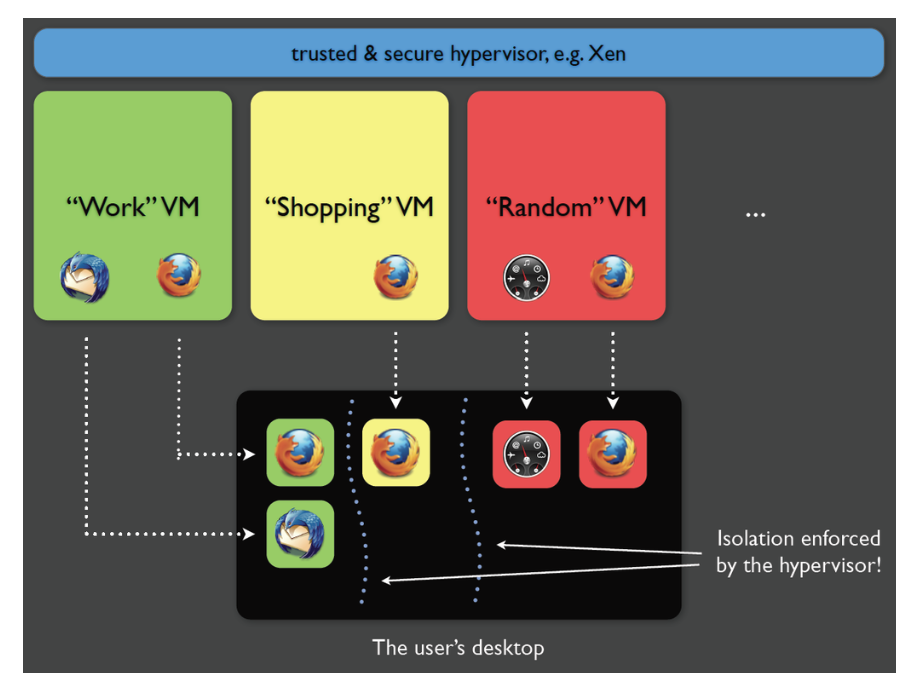

# Security
* **Data integrity**: File system features, backups etc.
* **User errors**: Protecting against "rm -rf /" and such
* **Malicious behaviour**: Protection against malicious behaviour. More complex and involves trade-off between ease of use and level of protection

## Vulnerabilities

### User authentication
Guessing passwords, exploiting open default accounts

Most common scheme is using a *username* and *passowrd*. Easy to use and understand but often too easily guessable. Shoulder surfing, keyloggers, default passwords etc. Where and how do you store passwords?

### Privilege escalation
Exploiting kernel bugs (race conditions etc.) to gain higher privileges than supposed to.

### Physical access
Goal is to gain and/or gather info with direct access to a computer.

Common targets
* Police evidence by forensics peeps
* Public access machines (ATMs, embedded devices in infrastructure)
* Damaged systems by data recovery peeps

## Solutions

* **Security by isolation**: Use virtualisation to separate parts of OS
  * Trade-off between security, usability and performance
  * Tends to use para-virtualisation
  * Qubes OS
    
* **Trusted computing**: Rely on hardware support to verify boot process and perform crypto operations
  * Use separate hardware module to secure OS
  * Present in most non-Apple laptops and desktops
  * Provides secure boot (all files used for booting are in *good* state)
    * TPM (Trusted Platform Module) stores signed hashes of bootloader low-level OS components in Platform Configuration Registers (PCRs)
    * BIOS and TMP check hashes on each boot-up
    * Trusted bootloader then verifies higher-level OS components
    * Any vulnerability in UEFI / BIOS, trusted bootloader or the TPM can break secure boot
  * Provides crypto operations for
    * **Platform integrity**: Verifying state of boot and OS components
    * **Remote attestation**: (?) Certifying software and hardware configuration
    * Allowing access to data only if the system is in a known state
    * Digital rights management
* **Trusted execution**: Separate OS into normal and secure domains (using hardware support)
  * Separating OS into *normal* and *secure* worlds
  * security-critical code (e.g. secure storage and crypto operations) runs in secure world
  * Example: Arm TrustZone
  * Present in most Android-based ARM phones and tablets
  * Hardware support to enforce the separation
