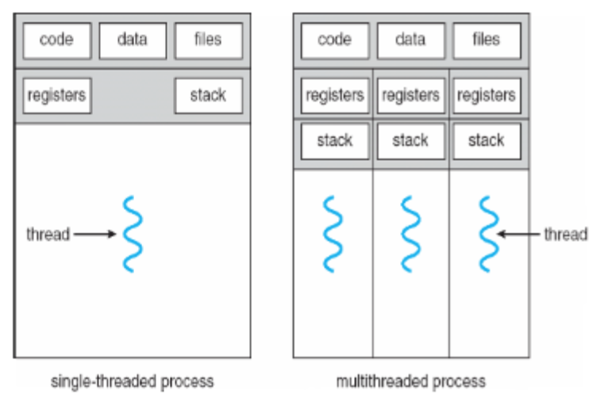
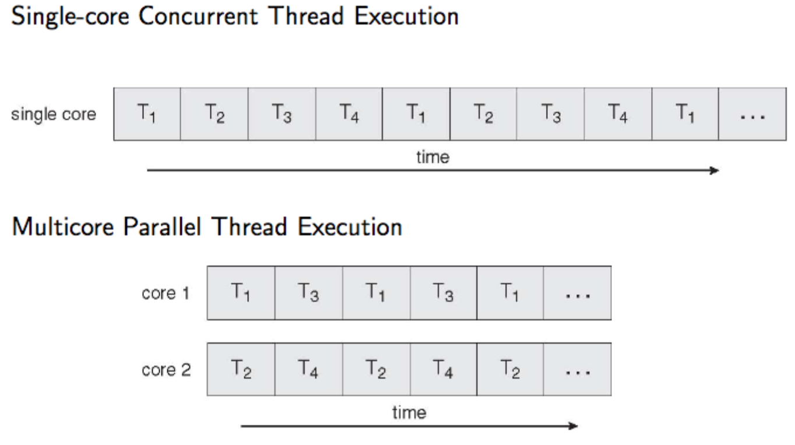
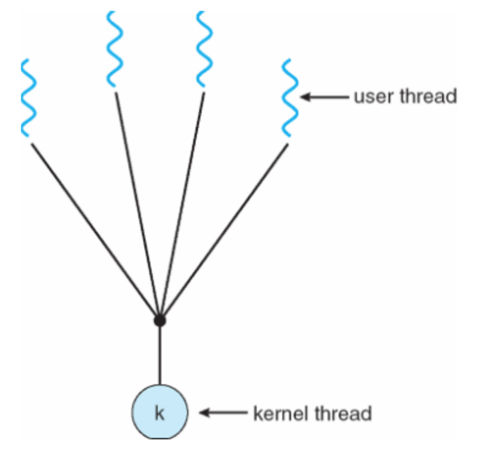
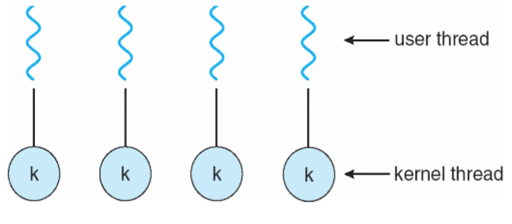
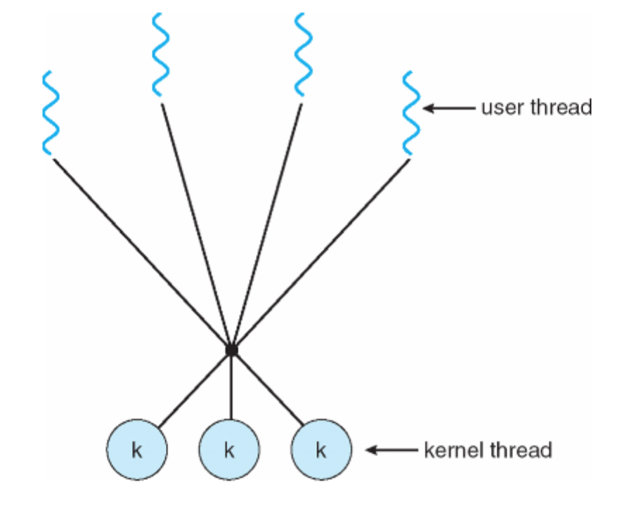
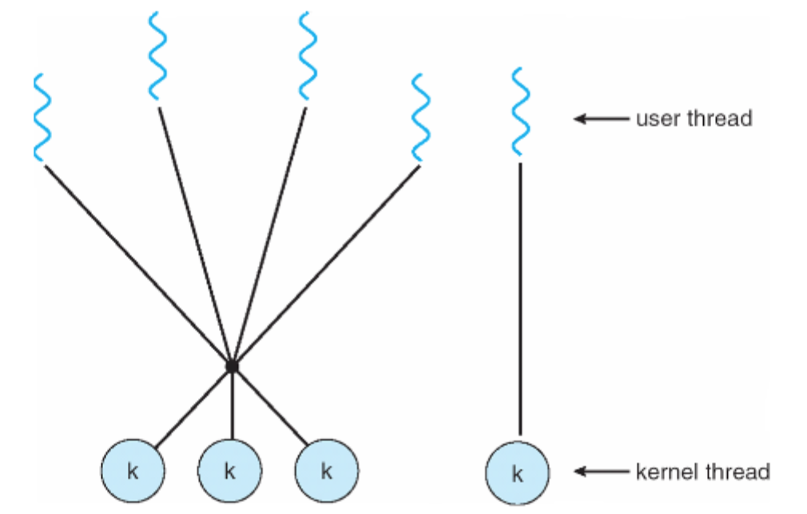

## Multithreaded processes
A thread is an execution state of a process
* Next instruction to execute
* Values of CPU registers
* Stack to hold local variables

### Benefits of threads
* **Responsiveness**: user interaction in a GUI can be responded to by a separate thread from the one doing computation
* **Resource sharing**: threads in a certain processes share address space and can therefore share memory to communicate
* **Economy**: Smaller memory footprint than running multiple processes
* **Scalability**: much easier to make use of parallel processing
* **reduce programming complexity**: problems can be broken down into parallel tasks rather than complex state machines

### Challenges with threads
* **Dividing activities**: how to make use of parallel processing
* **Balance**: how to balance the parallel tasks on the available cores to get maximum efficiency
* **Data splitting**: how can data sets be split for parallel processing
* **Data dependency**: some processing must be performed in order, so synchronisation is necessary (mutexes etc.)
* **Testing**: testing and debugging can be hard

### Threading models
A particular kernel may not support multi-threaded processes though it is still possible to implement threading in a user process. Threading models exist for mapping user threads to kernel threads.

* **Many to one**: many user level threads mapped to a single kernel thread/process
  * Useful if the kernel doesn't support threads
  * If one user thread calls a blocking kernel function
    * The whole process is blocked
    * Complex solutions exist where the user thread package intercepts blocking calls, changes them to non-blocking and implements a user-mode blocking mechanism.
  * Not the way to do it btw

  

* **One to one**: each user level thread maps to a kernel thread
  * Switching between threads requires a context switch by the kernel

  

* **Many to many**: Allows many user level threads to be mapped to many kernel threads
  * Best of both worlds, allows OS to create a sufficient number of kernel threads

  

* **Two level**: Similar to many to many but allows a user level thread to be bound directly to a kernel thread in a one to one way

### Thread cancellation
* **Asynchronous cancellation**: terminates the target thread immediately. Useful as a last resort if a thread will not stop
* **Deferred cancellation**: allows a target thread to periodically check if it should be cancelled. Often considered to be much cleaner and the thread can perform required cleanup processing (closing files, freeing memory etc.).

### Signal handling in threads
Options for passing signals to a multithreaded process
* Deliver the signal to the thread to which the signal applies
* Deliver signal to every thread in the process
* Deliver signal to certain threads in the process
* Assign as specific thread to receive all signals for the process

In most UNIX systems a thread can be configured to receive or block (not handle) certain signals to help overcome these issues.

### Thread pools
Under high request load, multithreaded servers can waste a lot of processing time creating and destroying threads. Thread pools are pools of pre-created threads that wait for work.

Advantages are that it is slightly faster to service a request with an existing thread rather than creating a new one, and that the number of threads in the application can be limited to ensure some level of service to a finite number of clients.
