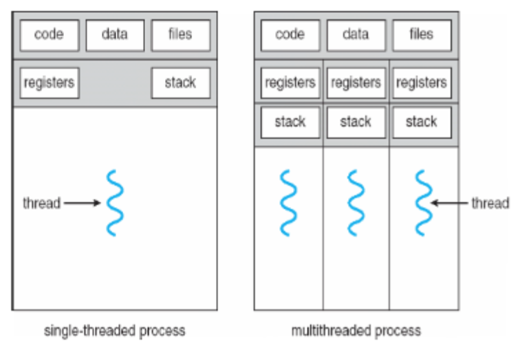
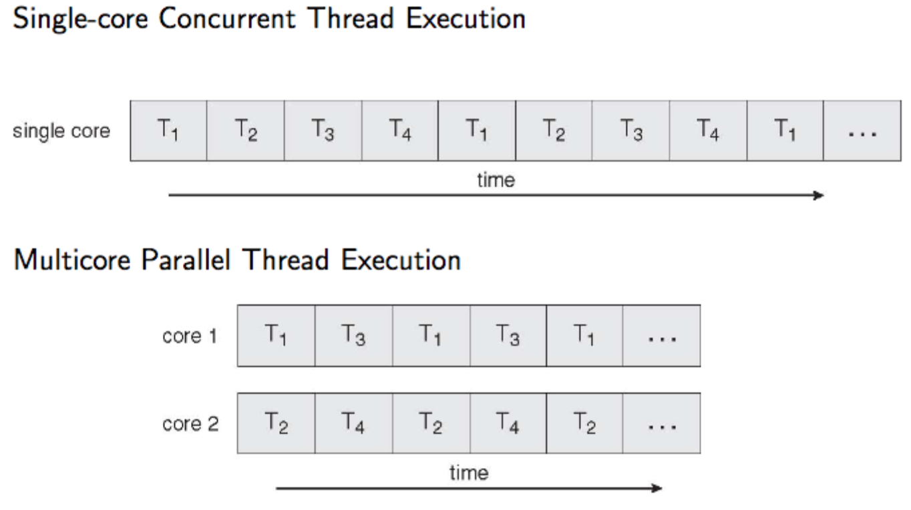
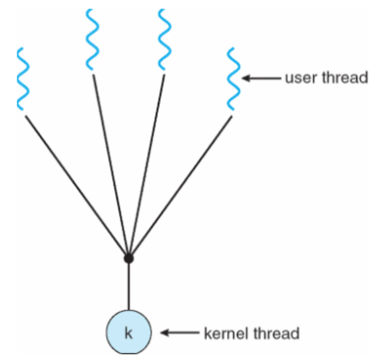
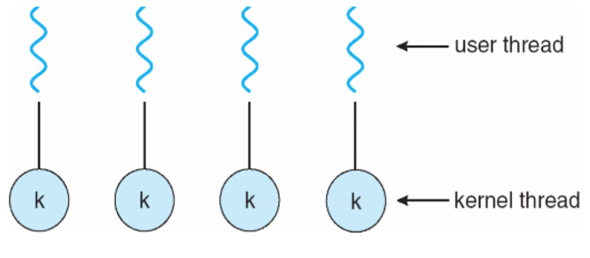
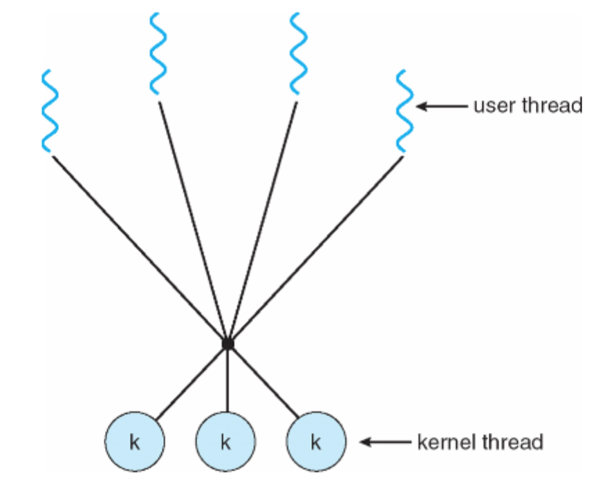
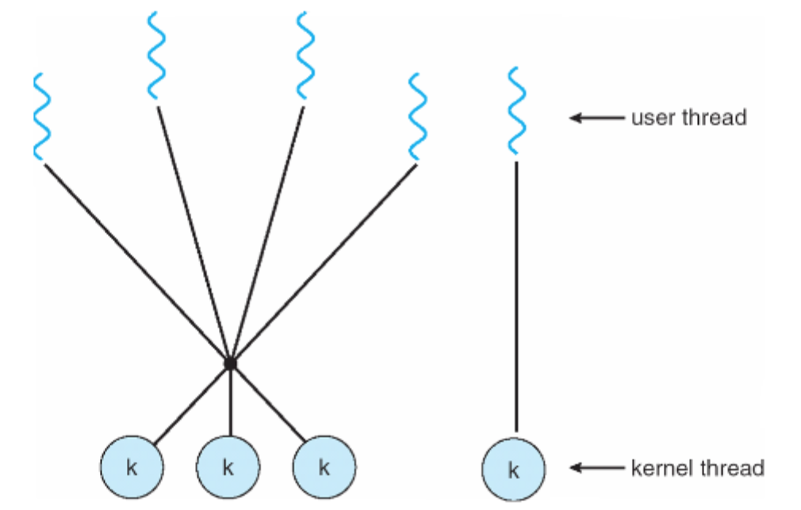

## Multithreaded processes
A thread is an execution state of a process
* Next instruction to execute
* Values of CPU registers
* Stack to hold local variables



### Benefits of threads
* **Responsiveness**: user interaction in a GUI can be responded to by a separate thread from the one doing computation
* **Resource sharing**: threads in a certain processes share address space and can therefore share memory to communicate
* **Economy**: Smaller memory footprint than running multiple processes
* **Scalability**: much easier to make use of parallel processing
* **reduce programming complexity**: problems can be broken down into parallel tasks rather than complex state machines

### Challenges with threads
* **Dividing activities**: how to make use of parallel processing
* **Balance**: how to balance the parallel tasks on the available cores to get maximum efficiency
* **Data splitting**: how can data sets be split for parallel processing
* **Data dependency**: some processing must be performed in order, so synchronisation is necessary (mutexes etc.)
* **Testing**: testing and debugging can be hard
* **Deadlock**: Two or more processes are waiting indefinitely for an event that is triggered by one of the waiting processes
* **Priority inversion**: Scheduling problem where lower-priority process holds a lock needed by a higher-priority process

#### Data inconsistency
Allowing multiple threads to access the same data at potentially the same time can introduce data inconsistency issues.
* **Mutual exclusion**: If process `P1` is in its critical section then no other processes can be in the same critical section.
* **Progress**: No process outside the critical section should block a process waiting to enter (being too greedy).
* **Bounded waiting**: A bound must exist on the number of times that other processes are allowed to enter the critical section after a process has made a request to enter its critical section and before that request is granted (i.e.it must be fair, so one poor process is not always waiting behind the others).

Many systems provide hardware support for critical sections. Modern machines provide special atomic hardware instructions __TestAndSet__ and/or __Swap__ that can be used to implement simple locks to achieve mutual exclusion.
* **TestAndSet**: Reads memory address then sets it
  ```
  boolean TestAndSet(boolean* address) {
    boolean original = *address;
    *address = TRUE;
    return original;
  }
  ```
  Useful because if it returns *FALSE* we know that only our thread has changed the value from *FALSE* to *TRUE*, if it returns *TRUE* then we know we haven't changed the value.
  ```
  while(TestAndSet(&lock));
  [critical section]
  lock = FALSE;
  [remainder section]
  ```
  This achieves mutual exclusion but not *bounded waiting*, as one process could potentially wait forever to enter the critical section. See [slide 21](https://canvas.bham.ac.uk/courses/27276/files/folder/Slides?preview=4664076) for that.
* **Swap**: Swap contents of two memory addresses

The *TestAndSet* approach outlined above is hugely wasteful of CPU cycles because of the constantly spinning while loop. A more efficient solution would sleep all threads until the thread currently in the currently section exits it, waking the other threads up.



### Threading models
A particular kernel may not support multi-threaded processes though it is still possible to implement threading in a user process. Threading models exist for mapping user threads to kernel threads.

* **Many to one**: many user level threads mapped to a single kernel thread/process
  * Useful if the kernel doesn't support threads
  * If one user thread calls a blocking kernel function
    * The whole process is blocked
    * Complex solutions exist where the user thread package intercepts blocking calls, changes them to non-blocking and implements a user-mode blocking mechanism.
  * Not the way to do it btw

  

* **One to one**: each user level thread maps to a kernel thread
  * Switching between threads requires a context switch by the kernel

  

* **Many to many**: Allows many user level threads to be mapped to many kernel threads
  * Best of both worlds, allows OS to create a sufficient number of kernel threads

  

* **Two level**: Similar to many to many but allows a user level thread to be bound directly to a kernel thread in a one to one way



### Thread cancellation
* **Asynchronous cancellation**: terminates the target thread immediately. Useful as a last resort if a thread will not stop
* **Deferred cancellation**: allows a target thread to periodically check if it should be cancelled. Often considered to be much cleaner and the thread can perform required cleanup processing (closing files, freeing memory etc.).

### Signal handling in threads
Options for passing signals to a multithreaded process
* Deliver the signal to the thread to which the signal applies
* Deliver signal to every thread in the process
* Deliver signal to certain threads in the process
* Assign as specific thread to receive all signals for the process

In most UNIX systems a thread can be configured to receive or block (not handle) certain signals to help overcome these issues.

### Threadpools
Under high request load, multithreaded servers can waste a lot of processing time creating and destroying threads. Thread pools are pools of pre-created threads that wait for work.

Advantages are that it is slightly faster to service a request with an existing thread rather than creating a new one, and that the number of threads in the application can be limited to ensure some level of service to a finite number of clients.

### Semaphores
* Simplifies synchronisation for the programmer
* Doesn't require busy-waiting
* Can guarantee bounded waiting time and progress

Consists of
* A semaphore type `S` that records a list of processes and an integer
* Two standard atomic (crucially) operations by which to modify `S`: `wait()` and `signal()`. Originally called `P()` and `V()` from the equivalent Dutch words

1. The semaphore is initialised with a count value of the maximum number of processes allowed in the critical section at the same time.
2. When a process calls `wait()`, if the count is zero it adds itself to the list of sleepers and blocks, else it decrements the count and enters the critical section.
3. When a process exits the critical section it calls `signal()` which increments the count and issues a wakeup call to the process at the head of the list, if there is one.
  * It's the use of ordered wake-ups (FIFO) that makes semaphores support bounded (fair) waiting.

Semaphores can be
* **Counting**: The count can range over an unrestricted domain, e.g at most `N` threads in section at once.
* **Binary**: Count can be 0 or 1.
  * A.k.a a mutex lock as it ensures mutual exclusion
  * Counting semaphore initialised to 1

Implementation on [slide 36](https://canvas.bham.ac.uk/courses/27276/files/folder/Slides?preview=4664076)
