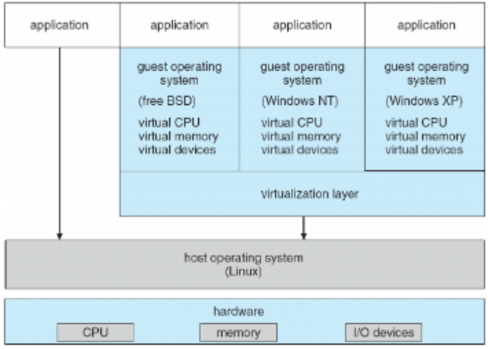

# Virtual Machines
A virtual machine (VM) takes a layered approach and treats hardware and the kernel as though they were all hardware. A VM provides an interface identical to the underlying bare hardware to mimic it. The OS host creates the illusion that a process has its own processor and memory. They shouldn't be confused with emulation, where guest instructions are run within a process that pretends to be the CPU (they are interpreted), instead they are run directly on the host CPU (so the guest OS must run on the host's architecture) .

They use a standard format called "Open Virtualisation Format" (OVF) so that a VM can run within many different VM platforms.

## Para-virtualisation
Presents the guest with a system similar (but not identical to) the hardware. The guest OS must be modified to be run on para-virtualised hardware.
* The kernel is recompiled with all privileged instructions being replaced with hooks into the virtualisation layer. This is necessary because the VM platform can't run these privileged instructions in kernel mode directly.
* Para-virtualisation is efficient and used for providing low-cost rented servers (Amazon EC2, Rackspace etc.)

## VMWare Architecture
VMWare implements full virtualisation, such that the guest OS doesn't require modification to run on the VM. The VM and guest OS run as a user-mode process on the host OS.

The VM must get around some problems to convince the guest OS that it is running on a privileged CPU mode, when it in fact isn't.

Guest OS instructions that could raise a CPU error must be replaced at run-time with alternatives that do the same but implement checks (less efficient). This is necessary as a CPU error would otherwise terminate the VM process, rather than the offending process in the guest OS. An example would be the `div` instruction as divide-by-zero errors could occur.
