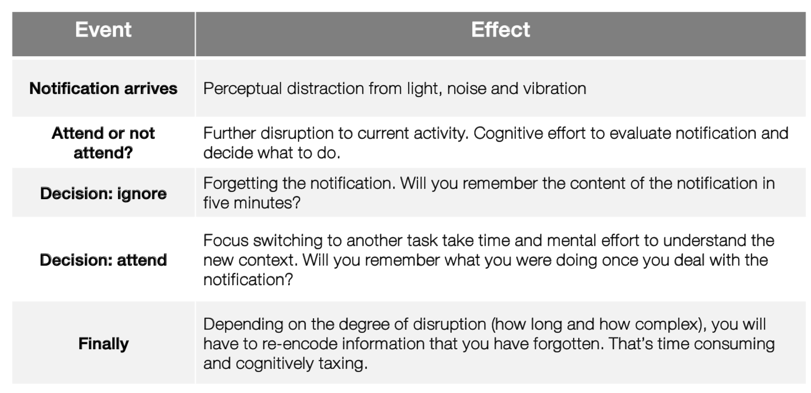

# Mobile notifications
Everything generates notifications

## Why are notifications disruptive?
* Perceptual draw, catch attention
  * Flashing screen, vibration, pulsing LEDs, ringers sound
* They require cognitive resources and thought
  * Deciding if they need to be responded to
  * Do you remember what you were doing before tending to the notification

## Switching activities
When we switch activities, there's a change in context. This change in context means we have to **encode** new information relevant to the new task (e.g switching from one programming project to another). When returning to a task, you might need to **re-encode** information you've forgotten. All of this can take time and effort, and can be error-prone.

## Overloaded people still check for notifications
* Sometimes interruptions are useful
* It becomes habitual or compulsive
* They can be time-critical
  * "Help! I'm stuck at the train station and my phone is dying"
* You're feeling bored and nothing is going on. Notifications can be exciting

Habitual and compulsive checking isn't rational as there's no clear utility gained from it.

## Making notifications better
* Timing of showing notifications is important
  * If you don't need to notify the user right now, don't
  * Don't notify when the user is driving etc.
* Context awareness
  * Only show work email notifications when at work
  * Don't show Canvas announcements when at the pub
